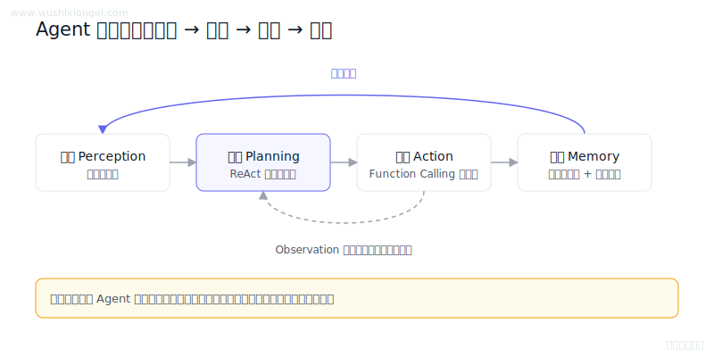
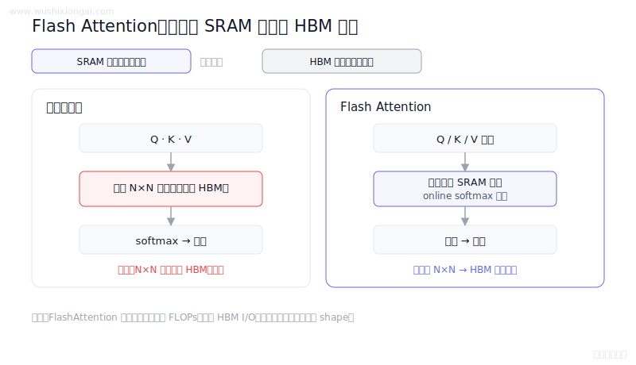
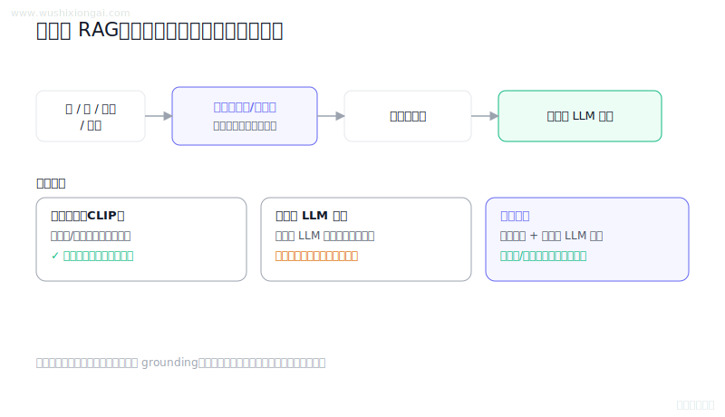
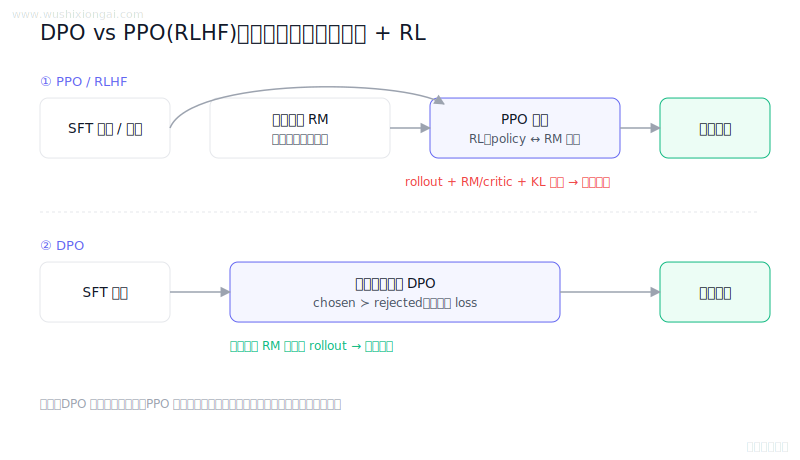

# 大模型面试题图解 100

**100 道题、100 张 SVG 概念图，配直接回答和可回查资料**

我是吴师兄（[@MisterBooo](https://github.com/MisterBooo)）。过去用 LeetCodeAnimation 讲算法，也维护 [RAG From Zero](https://github.com/MisterBooo/rag-from-zero)。这个仓库继续用图解方式整理大模型面试中的关键概念。

根目录只展示 12 道跨模块代表题，避免首页过长；完整 100 题按 14 个模块拆分，方便按主题阅读。每条内容都保留复核日期、来源等级和官网对应答案，便于核对与勘误。目前 74 题附有 202 条可回查资料，其余条目标明为教学整理。

- [完整大模型面试题库](https://www.wushixiongai.com/questions?utm_source=github&utm_medium=referral&utm_campaign=interview_100&utm_content=readme-intro-questions)
- [RAG、Agent 与 Deep Research 项目面试题](https://www.wushixiongai.com/questions/project?utm_source=github&utm_medium=referral&utm_campaign=interview_100&utm_content=readme-intro-projects)
- [内容复核办法](REVIEW_POLICY.md)
- [逐题复核清单与发布文件哈希](review-manifest.json)
- [发现错误时怎样提交勘误](CORRECTIONS.md)

## 14 个模块

| 模块 | 题数 | 主要内容 |
| --- | ---: | --- |
| [模型架构](modules/model-architecture.md) | 20 | 注意力、位置编码、归一化与模型结构 |
| [模型训练](modules/model-training.md) | 11 | 训练目标、优化过程、数据与稳定性 |
| [RLHF与对齐](modules/rlhf-alignment.md) | 8 | PPO、DPO、GRPO、奖励与策略优化 |
| [模型微调](modules/fine-tuning.md) | 4 | LoRA、PEFT、数据构造与微调取舍 |
| [推理优化](modules/inference-optimization.md) | 7 | KV Cache、量化、并行与服务性能 |
| [RAG基础](modules/rag-foundations.md) | 6 | 检索增强生成的链路、边界与验证 |
| [文档处理](modules/document-processing.md) | 1 | 解析、切分、清洗与结构保留 |
| [向量检索](modules/vector-search.md) | 9 | Embedding、ANN、召回与索引选型 |
| [重排与优化](modules/reranking.md) | 5 | Reranker、混合检索与质量优化 |
| [Prompt工程](modules/prompt-engineering.md) | 3 | 任务约束、结构化输出与提示设计 |
| [Agent](modules/agent.md) | 8 | 规划、工具调用、记忆与可靠性 |
| [多模态](modules/multimodal.md) | 8 | 视觉语言模型、对齐与多模态检索 |
| [评估与监控](modules/evaluation-monitoring.md) | 8 | 离线评测、线上监控与失败分析 |
| [知识图谱](modules/knowledge-graph.md) | 2 | GraphRAG、图检索与知识建模 |

## 先看这 12 张图

### RAG 三阶段原理与失败场景

> RAG 离线完成清洗、分块、向量化与索引，在线依次检索、重排、组装上下文并生成带依据的回答。

[查看 RAG基础 模块中的完整条目](modules/rag-foundations.md)

---

### Agent 系统实现流程与核心组件

> Agent 以感知、规划、工具执行和记忆组成反馈闭环，并通过停止条件、失败处理、权限与观测控制循环。

[查看 Agent 模块中的完整条目](modules/agent.md)

---

### RAG 错误根源怎么定位?

> 用黄金文档替换、检索消融和证据对齐可隔离变量，结合 Recall、相关性与忠实度定位检索或生成故障。

[查看 评估与监控 模块中的完整条目](modules/evaluation-monitoring.md)

---

### 混合检索怎么提升 RAG 召回?

> 混合检索利用BM25词面匹配与稠密语义召回的互补性，并通过名次融合、校准或重排合并结果。

[查看 向量检索 模块中的完整条目](modules/vector-search.md)

---

### Reranker 训练数据怎么构造?

> Reranker 数据应包含真实相关正样本、线上召回分布中的难负样本和适量易负样本，并持续质检回流。

[查看 重排与优化 模块中的完整条目](modules/reranking.md)

---

### 怎么让模型稳定输出 JSON?

> 稳定结构化输出应优先使用严格 Schema 或工具协议，再做解析校验、错误回灌、有限重试与失败降级。

[查看 Prompt工程 模块中的完整条目](modules/prompt-engineering.md)

---

### Flash Attention 原理怎么理解?

> FlashAttention 分块计算 Q、K、V 并用在线 softmax 累积，不物化完整注意力矩阵，从而减少 HBM I/O。

[查看 推理优化 模块中的完整条目](modules/inference-optimization.md)

---

### LoRA 低秩分解 vs 全量微调怎么选?

> LoRA 冻结原权重，将增量写成缩放后的低秩乘积 BA，只训练 A、B，从而显著降低可训练参数和优化器状态。

[查看 模型微调 模块中的完整条目](modules/fine-tuning.md)

---

### GraphRAG 原理与构建方法

> GraphRAG 从文档抽取实体关系、构建图和社区摘要，以局部关系检索与全局总结补充向量检索。

[查看 知识图谱 模块中的完整条目](modules/knowledge-graph.md)

---

### Multi-modal RAG 原理与挑战

> 多模态RAG对文本、图像、音视频分别编码和检索，并保留空间时间锚点以支持重排、生成与引用。

[查看 多模态 模块中的完整条目](modules/multimodal.md)

---

### Chunking 策略怎么选?

> 分块需在语义完整、检索噪声、召回覆盖和存储成本间权衡，并依据文档结构与查询类型在评测集上选参。

[查看 文档处理 模块中的完整条目](modules/document-processing.md)

---

### DPO vs PPO 怎么选?

> PPO 依赖在线 rollout、奖励与价值估计闭环，DPO 直接学习离线偏好对，工程链路更短但适用反馈不同。

[查看 RLHF与对齐 模块中的完整条目](modules/rlhf-alignment.md)

## 内容边界

- **B 级：** 源题中附有论文、官方文档或其他可回查资料；链接会跟随条目保留。
- **C 级：** 教学整理，当前没有独立来源链接；不包装成可核验的公司面试原题。
- 图解与摘要最近一次一致性初审日期为 **2026-07-19**；答案或 SVG 变化会触发哈希闸门。
- 图解用于快速建立结构，不能替代论文、官方文档、实验和目标环境验证。

## 许可状态

最终许可证需要仓库维护者在首次公开发布前确认。在 LICENSE 落地前，本仓库只提供查看，不构成复制、改编、再分发或商用授权，也不使用“开源”表述。许可选定后，更新源仓库的 `src/config/interview-repo.json`，生成结果才会持续保留该选择。

仓库地址：https://github.com/MisterBooo/llm-interview-questions
