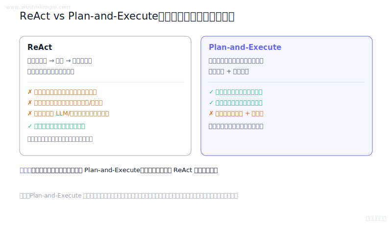
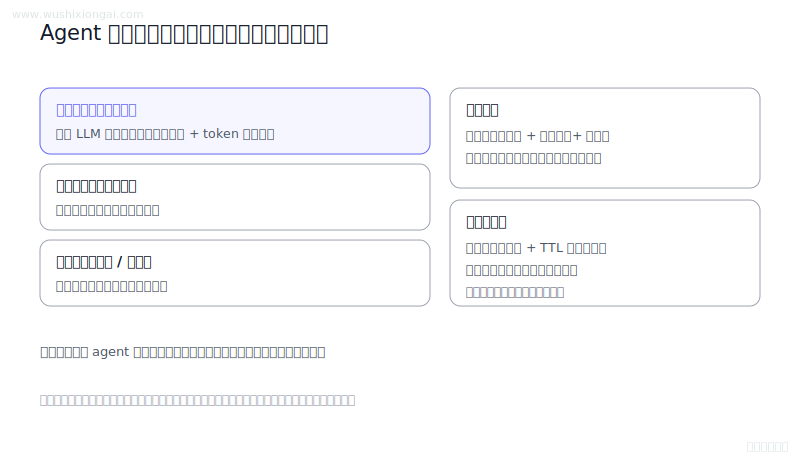
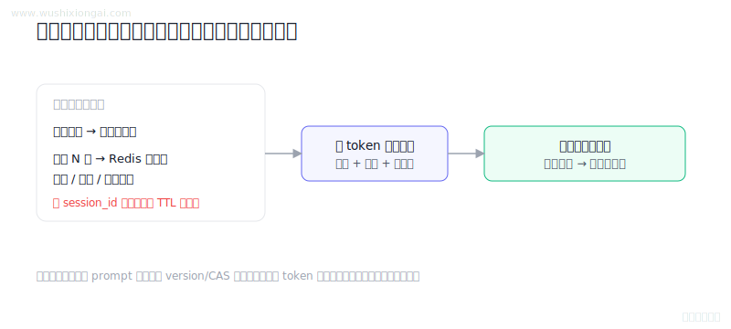
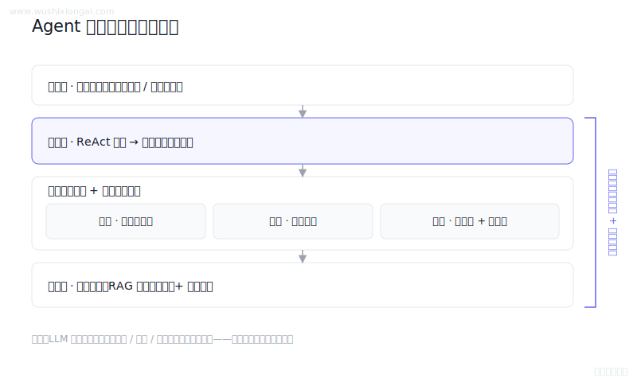
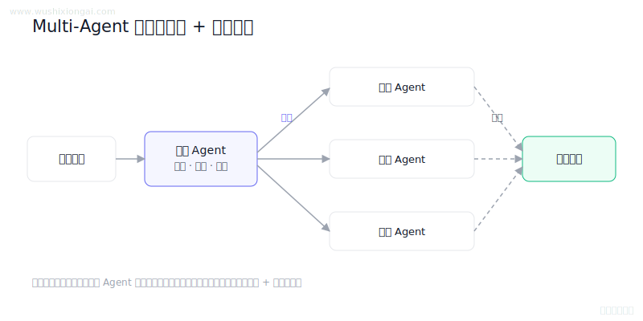
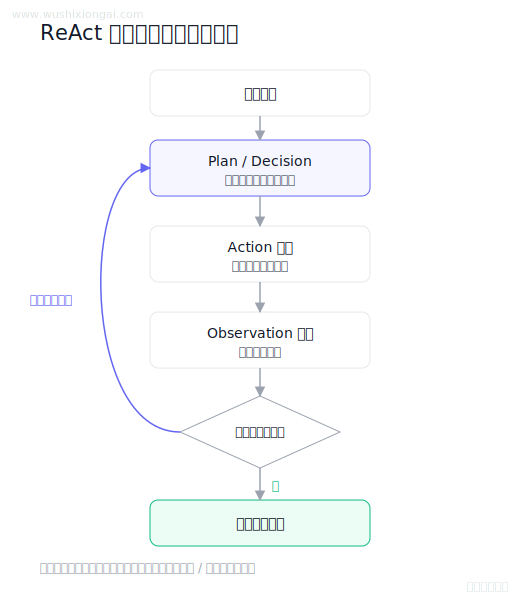
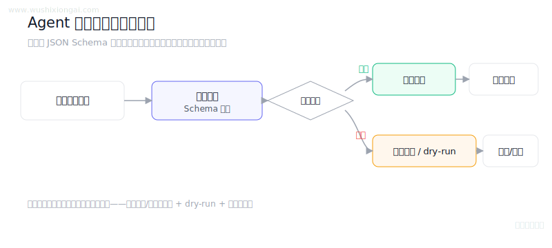

# Agent图解（8 题）

规划、工具调用、记忆与可靠性。本页摘要与图解均绑定正式答案哈希；答案或图解变化后，发布检查会要求重新复核。

[返回仓库首页](../README.md) · [在官网继续学习Agent](https://www.wushixiongai.com/questions/project/agent?utm_source=github&utm_medium=referral&utm_campaign=interview_100&utm_content=module-agent)

### 01. ReAct vs Plan-and-Execute 怎么选?

> **30 秒回答：** ReAct动态交错观察与动作，Plan架构显式管理任务，两者可用结构化状态和检查点组合。
>
> **继续追问：** 可继续讨论幂等工具、检查点、回滚与上下文压缩。

**复核：** 2026-07-19 · **来源等级：** B · 附可核验资料

**参考资料：**
- [ReAct: Synergizing Reasoning and Acting in Language Models](<https://arxiv.org/abs/2210.03629>)
- [LLM+P: Empowering Large Language Models with Optimal Planning Proficiency](<https://arxiv.org/abs/2304.11477>)

[在官网查看「ReAct vs Plan-and-Execute 怎么选?」的完整答案、口语讲法与连续追问](https://www.wushixiongai.com/q/agent-react-vs-plan-execute-context?utm_source=github&utm_medium=referral&utm_campaign=interview_100&utm_content=question-rag-q0025)

---

### 02. Agent 长短期记忆如何分层?

> **30 秒回答：** Agent记忆按工作、会话与长期职责管理，通过可追溯写入、受权检索、版本冲突和删除机制保证可靠。
>
> **继续追问：** 可继续讨论摘要失真、用户纠正优先级和多Agent隔离。

**复核：** 2026-07-19 · **来源等级：** B · 附可核验资料

**参考资料：**
- [Generative Agents: Interactive Simulacra of Human Behavior](<https://arxiv.org/abs/2304.03442>)
- [MemGPT: Towards LLMs as Operating Systems](<https://arxiv.org/abs/2310.08560>)

[在官网查看「Agent 长短期记忆如何分层?」的完整答案、口语讲法与连续追问](https://www.wushixiongai.com/q/agent-memory-system-architecture?utm_source=github&utm_medium=referral&utm_campaign=interview_100&utm_content=question-rag-q0026)

---

### 03. 多轮对话上下文状态管理机制

> **30 秒回答：** 对话系统应将持久会话状态与模型工作上下文分离，按 token 预算组装指令、摘要和最近轮，并以版本控制、分片、TTL 保证一致性与生命周期。
>
> **继续追问：** 如何选择应长期保留的外部状态，如何让摘要和关键事实可追溯并支持纠错。

**复核：** 2026-07-19 · **来源等级：** C · 教学整理

[在官网查看「多轮对话上下文状态管理机制」的完整答案、口语讲法与连续追问](https://www.wushixiongai.com/q/rag-conversation-state-management?utm_source=github&utm_medium=referral&utm_campaign=interview_100&utm_content=question-rag-q0063)

---

### 04. Agent模块协作机制与失败场景

> **30 秒回答：** 生产级 Agent 将感知、规划、分层记忆和工具执行模块化连接，由状态机、权限和反馈闭环约束自治范围。
>
> **继续追问：** 记忆、RAG 和实时工具结果冲突时怎么裁决，写操作如何防止越权和误执行。

**复核：** 2026-07-19 · **来源等级：** C · 教学整理

[在官网查看「Agent模块协作机制与失败场景」的完整答案、口语讲法与连续追问](https://www.wushixiongai.com/q/agent-autonomous-architecture-modules?utm_source=github&utm_medium=referral&utm_campaign=interview_100&utm_content=question-rag-q0065)

---

### 05. 多 Agent 协同如何分工?

> **30 秒回答：** 多智能体可由编排器进行任务拆解、路由和结果汇总，专职 Agent 通过标准消息协议协作，并用超时、验证、唯一处理权和人工回退控制风险。
>
> **继续追问：** Saga模式的具体实现、如何保证补偿操作的幂等性、以及不同一致性级别对用户体验的影响

**复核：** 2026-07-19 · **来源等级：** C · 教学整理

[在官网查看「多 Agent 协同如何分工?」的完整答案、口语讲法与连续追问](https://www.wushixiongai.com/q/agent-multi-agent-coordination-design?utm_source=github&utm_medium=referral&utm_campaign=interview_100&utm_content=question-rag-q0120)

---

### 06. Agent 系统实现流程与核心组件

> **30 秒回答：** Agent 以感知、规划、工具执行和记忆组成反馈闭环，并通过停止条件、失败处理、权限与观测控制循环。
>
> **继续追问：** 如何防止 ReAct 死循环，如何做 Agent trace，如何设计工具降级。

**复核：** 2026-07-19 · **来源等级：** C · 教学整理

[在官网查看「Agent 系统实现流程与核心组件」的完整答案、口语讲法与连续追问](https://www.wushixiongai.com/q/agent-implementation-flow-components?utm_source=github&utm_medium=referral&utm_campaign=interview_100&utm_content=question-rag-q0513)

---

### 07. ReAct 架构原理与失败场景

> **30 秒回答：** ReAct 将当前规划、工具行动和环境观察交替循环，使后续决策利用真实反馈，并在满足停止条件后输出答案。
>
> **继续追问：** 如何判断任务完成、如何防止工具调用死循环、如何记录结构化 ReAct trace。

**复核：** 2026-07-19 · **来源等级：** C · 教学整理

[在官网查看「ReAct 架构原理与失败场景」的完整答案、口语讲法与连续追问](https://www.wushixiongai.com/q/agent-react-design-workflow-benefits?utm_source=github&utm_medium=referral&utm_campaign=interview_100&utm_content=question-rag-q0521)

---

### 08. Agent工具定义、注册与安全控制有哪些？

> **30 秒回答：** Agent 工具通过 Schema 注册和参数校验接入，执行前需做权限与副作用分级，并配合沙箱、限额和审计。
>
> **继续追问：** 多工具编排用 ReAct、状态机还是 DAG，写操作如何保证幂等和可回滚。

**复核：** 2026-07-19 · **来源等级：** C · 教学整理

[在官网查看「Agent工具定义、注册与安全控制有哪些？」的完整答案、口语讲法与连续追问](https://www.wushixiongai.com/q/agent-tool-definition-registration-security?utm_source=github&utm_medium=referral&utm_campaign=interview_100&utm_content=question-rag-q0624)

---

[返回仓库首页](../README.md) · [在官网继续学习Agent](https://www.wushixiongai.com/questions/project/agent?utm_source=github&utm_medium=referral&utm_campaign=interview_100&utm_content=module-agent)
