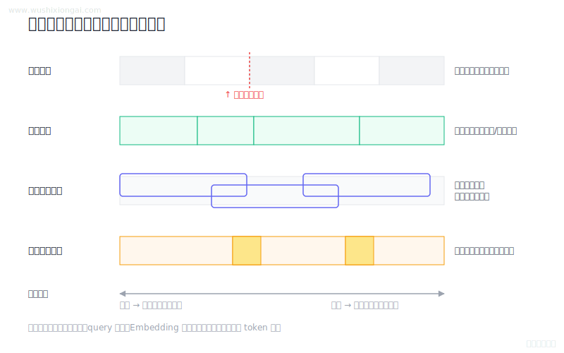

# 文档处理图解（1 题）

解析、切分、清洗与结构保留。本页摘要与图解均绑定正式答案哈希；答案或图解变化后，发布检查会要求重新复核。

[返回仓库首页](../README.md) · [在官网继续学习文档处理](https://www.wushixiongai.com/rag?utm_source=github&utm_medium=referral&utm_campaign=interview_100&utm_content=module-document-processing)

### 01. Chunking 策略怎么选?

> **30 秒回答：** 分块需在语义完整、检索噪声、召回覆盖和存储成本间权衡，并依据文档结构与查询类型在评测集上选参。
>
> **继续追问：** 如何设计 chunking A/B 实验，metadata 怎么补上下文，父子块检索如何实现。

**复核：** 2026-07-19 · **来源等级：** C · 教学整理

[在官网查看「Chunking 策略怎么选?」的完整答案、口语讲法与连续追问](https://www.wushixiongai.com/q/rag-chunking-strategies-performance-impact?utm_source=github&utm_medium=referral&utm_campaign=interview_100&utm_content=question-rag-q0083)

---

[返回仓库首页](../README.md) · [在官网继续学习文档处理](https://www.wushixiongai.com/rag?utm_source=github&utm_medium=referral&utm_campaign=interview_100&utm_content=module-document-processing)
