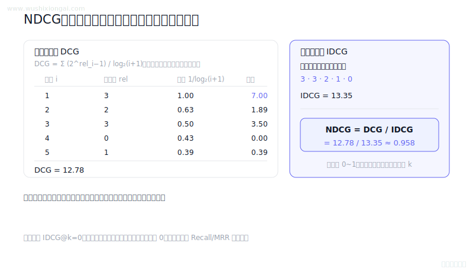
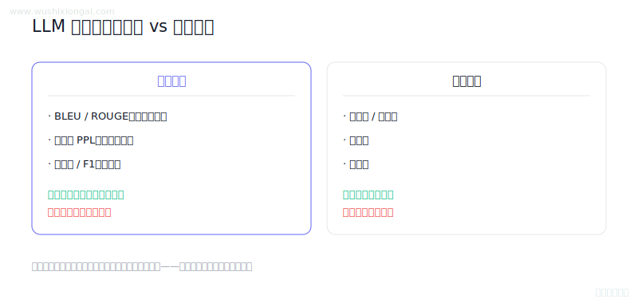
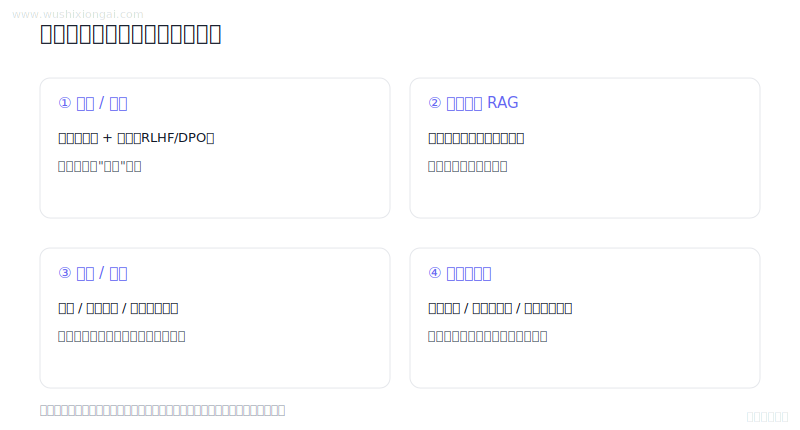
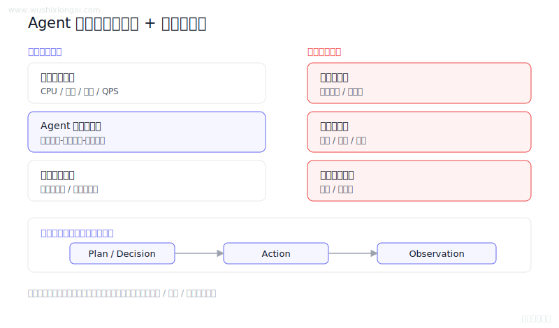
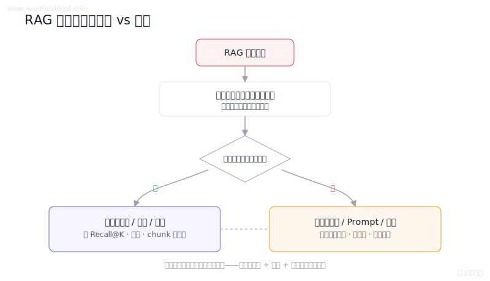
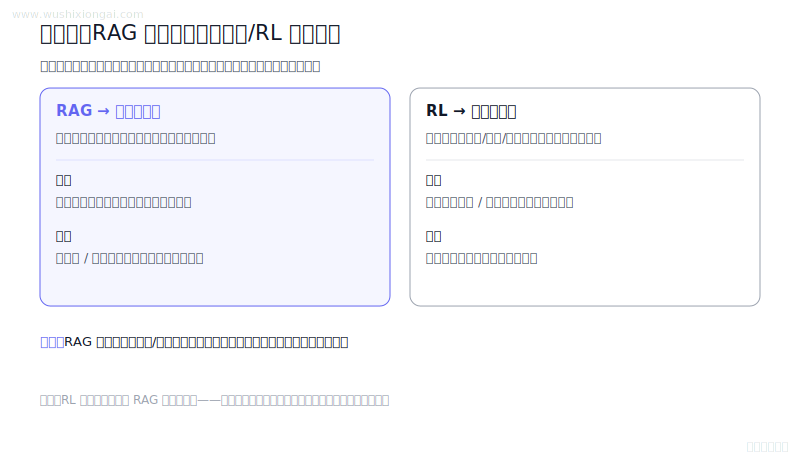
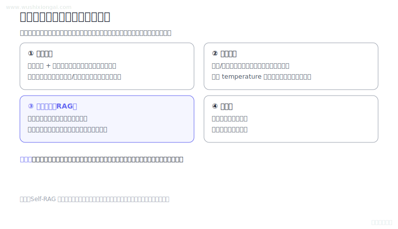
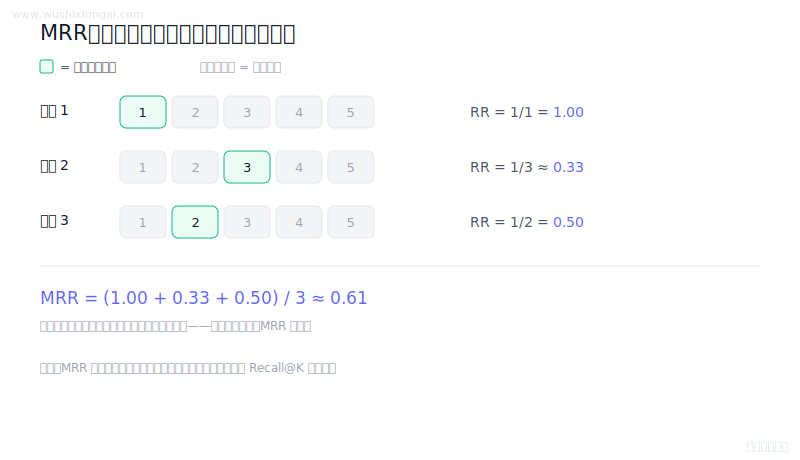

# 评估与监控图解（8 题）

离线评测、线上监控与失败分析。本页摘要与图解均绑定正式答案哈希；答案或图解变化后，发布检查会要求重新复核。

[返回仓库首页](../README.md) · [在官网继续学习评估与监控](https://www.wushixiongai.com/evaluation?utm_source=github&utm_medium=referral&utm_campaign=interview_100&utm_content=module-evaluation-monitoring)

### 01. NDCG 怎么计算?

> **30 秒回答：** NDCG用位置折扣累积相关性增益并除以理想排序的DCG，从而在同一查询内归一化排序质量。
>
> **继续追问：** 可继续讨论线性与指数增益、位置偏差、IDCG为零和跨查询聚合。

**复核：** 2026-07-19 · **来源等级：** B · 附可核验资料

**参考资料：**
- [Cumulated Gain-Based Evaluation of IR Techniques](<https://dl.acm.org/doi/10.1145/582415.582418>)
- [scikit-learn ndcg\_score Documentation](<https://scikit-learn.org/stable/modules/generated/sklearn.metrics.ndcg_score.html>)

[在官网查看「NDCG 怎么计算?」的完整答案、口语讲法与连续追问](https://www.wushixiongai.com/q/eval-ndcg-calculation-explained?utm_source=github&utm_medium=referral&utm_campaign=interview_100&utm_content=question-eval-ndcg-f1-q0406)

---

### 02. 自动 vs 人工评价怎么选?

> **30 秒回答：** LLM 评估应组合参考式、无参考、执行式、任务指标、模型裁判与人工 rubric，并报告自动指标偏差、人工一致性及置信区间。
>
> **继续追问：** 可继续比较 model-as-judge 的位置偏差，或为 faithfulness 设计逐断言人工 rubric。

**复核：** 2026-07-19 · **来源等级：** B · 附可核验资料

**参考资料：**
- [BLEU: a Method for Automatic Evaluation of Machine Translation](<https://aclanthology.org/P02-1040/>)
- [ROUGE: A Package for Automatic Evaluation of Summaries](<https://aclanthology.org/W04-1013/>)
- [BERTScore: Evaluating Text Generation with BERT](<https://arxiv.org/abs/1904.09675>)
- [Judging LLM-as-a-Judge with MT-Bench and Chatbot Arena](<https://arxiv.org/abs/2306.05685>)

[在官网查看「自动 vs 人工评价怎么选?」的完整答案、口语讲法与连续追问](https://www.wushixiongai.com/q/eval-automatic-vs-human-metrics?utm_source=github&utm_medium=referral&utm_campaign=interview_100&utm_content=question-eval-q0391)

---

### 03. LLM 幻觉与安全风险怎么缓解?

> **30 秒回答：** 幻觉与安全风险需要数据治理、证据检索、解码和工具权限约束、输出核验及分项评测共同防御，任何单一手段都不能保证事实与安全。
>
> **继续追问：** 可继续推导 DPO 目标中 reference policy 的作用，或设计检索提示注入的攻击与防护测试。

**复核：** 2026-07-19 · **来源等级：** B · 附可核验资料

**参考资料：**
- [Direct Preference Optimization](<https://arxiv.org/abs/2305.18290>)
- [Contrastive Decoding: Open-ended Text Generation as Optimization](<https://arxiv.org/abs/2210.15097>)
- [Retrieval-Augmented Generation for Knowledge-Intensive NLP Tasks](<https://arxiv.org/abs/2005.11401>)
- [A Watermark for Large Language Models](<https://arxiv.org/abs/2301.10226>)

[在官网查看「LLM 幻觉与安全风险怎么缓解?」的完整答案、口语讲法与连续追问](https://www.wushixiongai.com/q/eval-hallucination-safety-mitigation?utm_source=github&utm_medium=referral&utm_campaign=interview_100&utm_content=question-eval-q0404)

---

### 04. Agent 系统哪些模块最易出问题?

> **30 秒回答：** Agent 可观测性需贯通基础设施、运行时和业务指标，并记录输入、规划决策、工具调用、结果与延迟分解。
>
> **继续追问：** 如何做 trace 回放，如何设置熔断阈值，混沌工程如何验证降级策略。

**复核：** 2026-07-19 · **来源等级：** C · 教学整理

[在官网查看「Agent 系统哪些模块最易出问题?」的完整答案、口语讲法与连续追问](https://www.wushixiongai.com/q/agent-monitoring-system-fault-localization?utm_source=github&utm_medium=referral&utm_campaign=interview_100&utm_content=question-rag-q0091)

---

### 05. RAG 错误根源怎么定位?

> **30 秒回答：** 用黄金文档替换、检索消融和证据对齐可隔离变量，结合 Recall、相关性与忠实度定位检索或生成故障。
>
> **继续追问：** 如何构造 misleading context 测试集，如何评估 faithfulness，如何把检索指标和答案指标对齐。

**复核：** 2026-07-19 · **来源等级：** C · 教学整理

[在官网查看「RAG 错误根源怎么定位?」的完整答案、口语讲法与连续追问](https://www.wushixiongai.com/q/rag-error-source-retriever-vs-generator?utm_source=github&utm_medium=referral&utm_campaign=interview_100&utm_content=question-rag-q0142)

---

### 06. 知识型与行为型错误诊断

> **30 秒回答：** RAG补充可更新外部证据，强化学习塑造可验证行为，两者都需结合检索质量与后验验证。
>
> **继续追问：** RL优化检索决策的具体方法，比如奖励信号如何设计，以及这种方案相比固定RAG的优势和风险。

**复核：** 2026-07-19 · **来源等级：** B · 附可核验资料

**参考资料：**
- [Retrieval-Augmented Generation for Knowledge-Intensive NLP Tasks](<https://arxiv.org/abs/2005.11401>)
- [Training language models to follow instructions with human feedback](<https://arxiv.org/abs/2203.02155>)

[在官网查看「知识型与行为型错误诊断」的完整答案、口语讲法与连续追问](https://www.wushixiongai.com/q/eval-hallucination-rag-vs-rl-scenarios?utm_source=github&utm_medium=referral&utm_campaign=interview_100&utm_content=question-rag-q0286)

---

### 07. 训练/推理/知识增强怎么选?

> **30 秒回答：** 幻觉治理需组合数据与对齐、推理控制、RAG、工具验证、拒答和人工复核，并分层评估失败来源。
>
> **继续追问：** Self-RAG 的具体实现、与传统 RAG 的区别、以及适用场景的边界。

**复核：** 2026-07-19 · **来源等级：** B · 附可核验资料

**参考资料：**
- [Survey of Hallucination in Natural Language Generation](<https://arxiv.org/abs/2202.03629>)
- [Retrieval-Augmented Generation for Knowledge-Intensive NLP Tasks](<https://arxiv.org/abs/2005.11401>)
- [SelfCheckGPT: Zero-Resource Black-Box Hallucination Detection for Generative Large Language Models](<https://arxiv.org/abs/2303.08896>)

[在官网查看「训练/推理/知识增强怎么选?」的完整答案、口语讲法与连续追问](https://www.wushixiongai.com/q/eval-hallucination-multi-layer-mitigation?utm_source=github&utm_medium=referral&utm_campaign=interview_100&utm_content=question-rag-q0527)

---

### 08. MRR 在 RAG 中怎么定义?

> **30 秒回答：** MRR 是各查询首个相关结果倒数排名的平均值，强调首个命中的排序位置，但不能代表端到端回答质量。
>
> **继续追问：** 如何把 MRR、Recall@K、NDCG、Faithfulness 组合成一套 RAG 评估体系。

**复核：** 2026-07-19 · **来源等级：** C · 教学整理

[在官网查看「MRR 在 RAG 中怎么定义?」的完整答案、口语讲法与连续追问](https://www.wushixiongai.com/q/eval-mrr-definition-rag-significance?utm_source=github&utm_medium=referral&utm_campaign=interview_100&utm_content=question-rag-q0633)

---

[返回仓库首页](../README.md) · [在官网继续学习评估与监控](https://www.wushixiongai.com/evaluation?utm_source=github&utm_medium=referral&utm_campaign=interview_100&utm_content=module-evaluation-monitoring)
