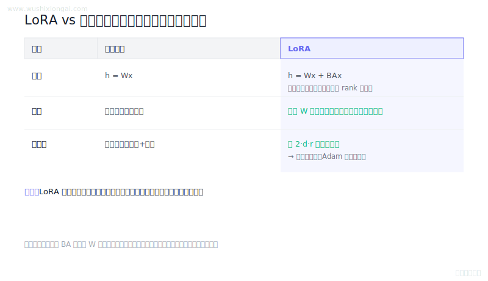
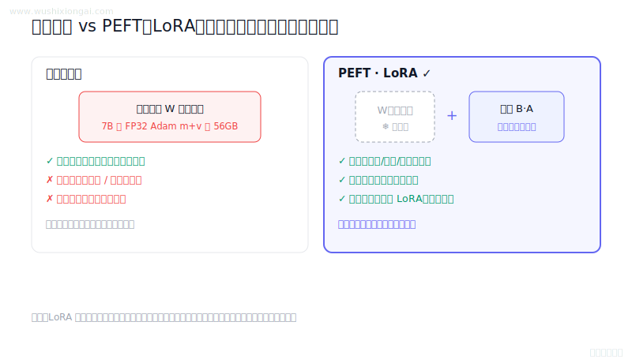
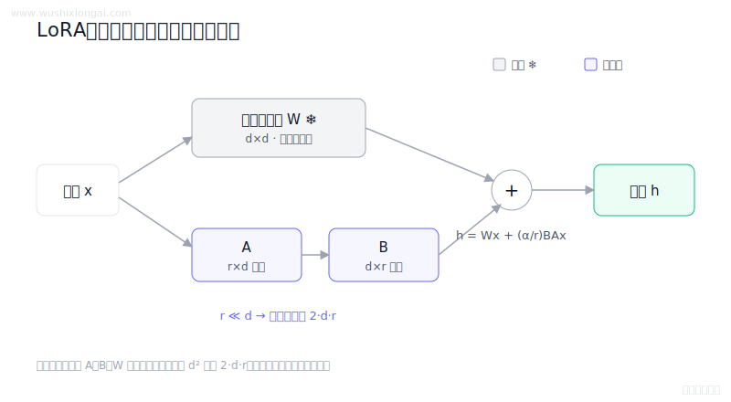
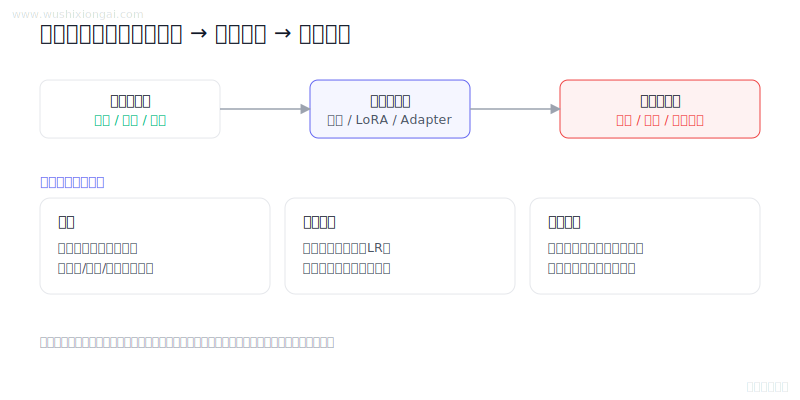

# 模型微调图解（4 题）

LoRA、PEFT、数据构造与微调取舍。本页摘要与图解均绑定正式答案哈希；答案或图解变化后，发布检查会要求重新复核。

[返回仓库首页](../README.md) · [在官网继续学习模型微调](https://www.wushixiongai.com/finetune?utm_source=github&utm_medium=referral&utm_campaign=interview_100&utm_content=module-fine-tuning)

### 01. LoRA 微调比全量微调更慢吗？

> **30 秒回答：** LoRA减少可训练参数、参数梯度和优化器状态，但仍经过冻结主干计算，单步训练不保证更快。
>
> **继续追问：** 可继续讨论线性层输入梯度、checkpointing、通信和QLoRA区别。

**复核：** 2026-07-19 · **来源等级：** B · 附可核验资料

**参考资料：**
- [LoRA: Low-Rank Adaptation of Large Language Models](<https://arxiv.org/abs/2106.09685>)
- [QLoRA: Efficient Finetuning of Quantized LLMs](<https://arxiv.org/abs/2305.14314>)

[在官网查看「LoRA 微调比全量微调更慢吗？」的完整答案、口语讲法与连续追问](https://www.wushixiongai.com/q/train-lora-vs-full-compute-cost?utm_source=github&utm_medium=referral&utm_campaign=interview_100&utm_content=question-train-lora-vs-full-q0313)

---

### 02. 全参数 vs 参数高效微调怎么选?

> **30 秒回答：** PEFT只训练少量新增或选定参数，可降低权重与优化器状态开销，但主干计算和激活仍然存在。
>
> **继续追问：** 可继续讨论激活、冻结基座、量化、ZeRO分片和target modules。

**复核：** 2026-07-19 · **来源等级：** B · 附可核验资料

**参考资料：**
- [LoRA: Low-Rank Adaptation of Large Language Models](<https://arxiv.org/abs/2106.09685>)
- [QLoRA: Efficient Finetuning of Quantized LLMs](<https://arxiv.org/abs/2305.14314>)
- [ZeRO: Memory Optimizations Toward Training Trillion Parameter Models](<https://arxiv.org/abs/1910.02054>)

[在官网查看「全参数 vs 参数高效微调怎么选?」的完整答案、口语讲法与连续追问](https://www.wushixiongai.com/q/train-full-vs-parameter-efficient-finetuning?utm_source=github&utm_medium=referral&utm_campaign=interview_100&utm_content=question-train-peft-overview-q0093)

---

### 03. LoRA 低秩分解 vs 全量微调怎么选?

> **30 秒回答：** LoRA 冻结原权重，将增量写成缩放后的低秩乘积 BA，只训练 A、B，从而显著降低可训练参数和优化器状态。
>
> **继续追问：** 可继续讨论target modules、rank、alpha、合并和多适配器服务。

**复核：** 2026-07-19 · **来源等级：** B · 附可核验资料

**参考资料：**
- [LoRA: Low-Rank Adaptation of Large Language Models](<https://arxiv.org/abs/2106.09685>)
- [LLaMA: Open and Efficient Foundation Language Models](<https://arxiv.org/abs/2302.13971>)
- [Hugging Face PEFT LoRA documentation](<https://huggingface.co/docs/peft/main/en/conceptual_guides/lora>)

[在官网查看「LoRA 低秩分解 vs 全量微调怎么选?」的完整答案、口语讲法与连续追问](https://www.wushixiongai.com/q/train-lora-low-rank-principle?utm_source=github&utm_medium=referral&utm_campaign=interview_100&utm_content=question-train-q0205)

---

### 04. 大模型微调方法怎么选?

> **30 秒回答：** 微调实践应用真实运行证据说明任务基线、数据许可与切分、方法配置、消融实验、质量成本和失败切片，未实际执行的信息不应代写。
>
> **继续追问：** LoRA 目标层和 rank 如何选，或如何排查数据泄漏与灾难性遗忘。

**复核：** 2026-07-19 · **来源等级：** B · 附可核验资料

**参考资料：**
- [LoRA: Low-Rank Adaptation of Large Language Models](<https://arxiv.org/abs/2106.09685>)
- [Parameter-Efficient Transfer Learning for NLP](<https://arxiv.org/abs/1902.00751>)
- [Hugging Face PEFT Documentation](<https://huggingface.co/docs/peft/index>)

[在官网查看「大模型微调方法怎么选?」的完整答案、口语讲法与连续追问](https://www.wushixiongai.com/q/project-finetuning-practical-experience?utm_source=github&utm_medium=referral&utm_campaign=interview_100&utm_content=question-train-q0411)

---

[返回仓库首页](../README.md) · [在官网继续学习模型微调](https://www.wushixiongai.com/finetune?utm_source=github&utm_medium=referral&utm_campaign=interview_100&utm_content=module-fine-tuning)
