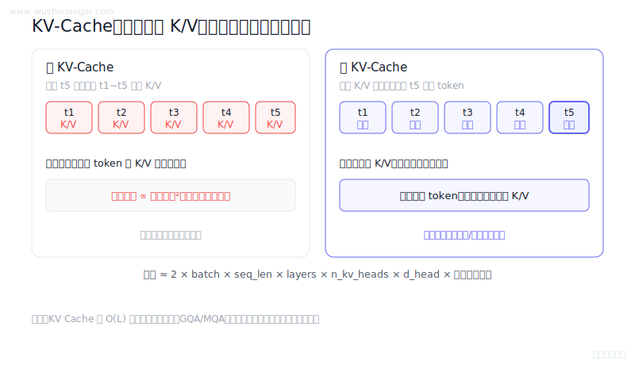
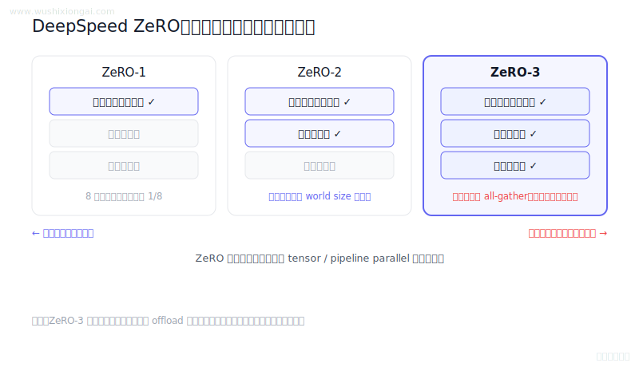
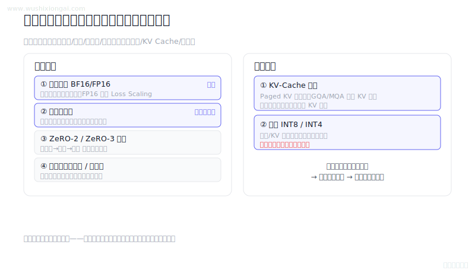
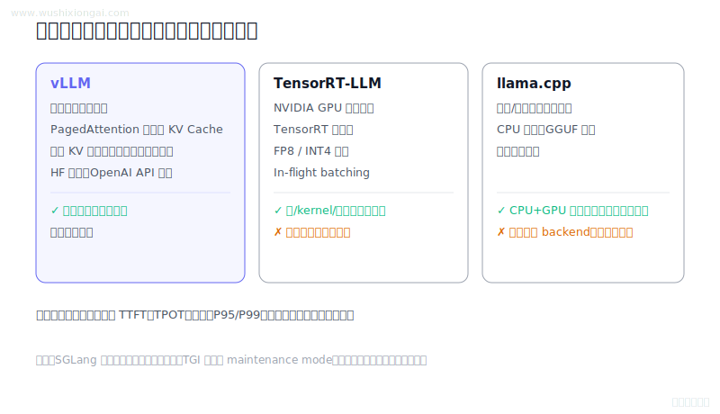
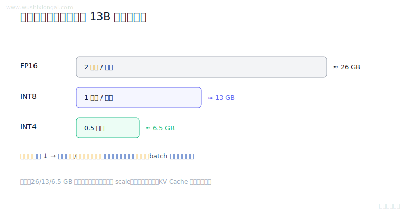
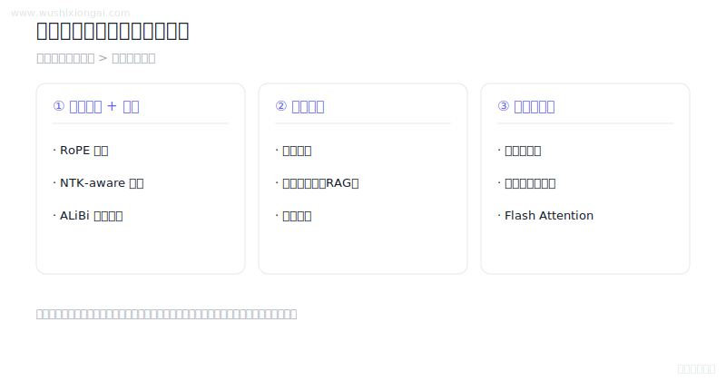

# 推理优化图解（7 题）

KV Cache、量化、并行与服务性能。本页摘要与图解均绑定正式答案哈希；答案或图解变化后，发布检查会要求重新复核。

[返回仓库首页](../README.md) · [在官网继续学习推理优化](https://www.wushixiongai.com/transformer?utm_source=github&utm_medium=referral&utm_campaign=interview_100&utm_content=module-inference-optimization)

### 01. KV-Cache 空间复杂度怎么算?

> **30 秒回答：** KV Cache 保存各层历史 K/V，空间随批次、序列长度、层数和 KV 头数线性增长，可用 GQA/MQA、量化、分页或窗口化降低不同成本。
>
> **继续追问：** 可继续讨论连续批处理、前缀缓存和块大小对吞吐的影响。

**复核：** 2026-07-19 · **来源等级：** B · 附可核验资料

**参考资料：**
- [Llama 2: Open Foundation and Fine-Tuned Chat Models](<https://arxiv.org/abs/2307.09288>)
- [Efficient Memory Management for Large Language Model Serving with PagedAttention](<https://arxiv.org/abs/2309.06180>)

[在官网查看「KV-Cache 空间复杂度怎么算?」的完整答案、口语讲法与连续追问](https://www.wushixiongai.com/q/arch-kv-cache-space-complexity?utm_source=github&utm_medium=referral&utm_campaign=interview_100&utm_content=question-arch-kv-cache-q0051)

---

### 02. DeepSpeed 核心特性与架构怎么用?

> **30 秒回答：** DeepSpeed通过ZeRO、混合精度、检查点和多维并行扩展训练，收益取决于模型、集群和通信瓶颈。
>
> **继续追问：** ZeRO-3 all-gather 峰值、offload 瓶颈和分片 checkpoint 如何跨拓扑迁移。

**复核：** 2026-07-19 · **来源等级：** B · 附可核验资料

**参考资料：**
- [ZeRO: Memory Optimizations Toward Training Trillion Parameter Models](<https://arxiv.org/abs/1910.02054>)
- [DeepSpeed ZeRO official documentation](<https://deepspeed.readthedocs.io/en/latest/zero3.html>)
- [DeepSpeed Model Checkpointing official documentation](<https://deepspeed.readthedocs.io/en/latest/model-checkpointing.html>)

[在官网查看「DeepSpeed 核心特性与架构怎么用?」的完整答案、口语讲法与连续追问](https://www.wushixiongai.com/q/infra-deepspeed-framework?utm_source=github&utm_medium=referral&utm_campaign=interview_100&utm_content=question-sys-deepspeed-q0110)

---

### 03. Flash Attention 原理怎么理解?

> **30 秒回答：** FlashAttention 分块计算 Q、K、V 并用在线 softmax 累积，不物化完整注意力矩阵，从而减少 HBM I/O。
>
> **继续追问：** 怎样为不同 head dimension 和序列长度选择分块，并公平测量 prefill 与 decode 收益？

**复核：** 2026-07-19 · **来源等级：** B · 附可核验资料

**参考资料：**
- [FlashAttention: Fast and Memory-Efficient Exact Attention with IO-Awareness](<https://arxiv.org/abs/2205.14135>)
- [The I/O Complexity of Attention, or How Optimal is FlashAttention?](<https://arxiv.org/abs/2402.07443>)

[在官网查看「Flash Attention 原理怎么理解?」的完整答案、口语讲法与连续追问](https://www.wushixiongai.com/q/arch-flash-attention-io-optimization?utm_source=github&utm_medium=referral&utm_campaign=interview_100&utm_content=question-sys-flash-attn-q0002)

---

### 04. 显存优化技术原理与对比

> **30 秒回答：** 大模型显存由参数、梯度、优化器状态、激活与临时缓冲共同构成，优化需按实测瓶颈选择。
>
> **继续追问：** 某一配置下参数、Adam 状态、激活或 KV Cache 的字节数如何估算。

**复核：** 2026-07-19 · **来源等级：** B · 附可核验资料

**参考资料：**
- [Training Deep Nets with Sublinear Memory Cost](<https://arxiv.org/abs/1604.06174>)
- [ZeRO: Memory Optimizations Toward Training Trillion Parameter Models](<https://arxiv.org/abs/1910.02054>)
- [FlashAttention: Fast and Memory-Efficient Exact Attention with IO-Awareness](<https://arxiv.org/abs/2205.14135>)
- [PyTorch Automatic Mixed Precision official documentation](<https://docs.pytorch.org/docs/stable/amp.html>)

[在官网查看「显存优化技术原理与对比」的完整答案、口语讲法与连续追问](https://www.wushixiongai.com/q/infra-gpu-memory-optimization?utm_source=github&utm_medium=referral&utm_campaign=interview_100&utm_content=question-sys-memory-opt-q0053)

---

### 05. LLM 推理框架综合选型

> **30 秒回答：** 推理框架应按模型兼容、硬件、吞吐、尾延迟、量化、并行和运维成熟度在目标负载上选择。
>
> **继续追问：** 可继续设计固定模型与请求分布的 TTFT、TPOT、吞吐、显存和稳定性基准。

**复核：** 2026-07-19 · **来源等级：** B · 附可核验资料

**参考资料：**
- [vLLM GPU Installation and Supported Hardware](<https://docs.vllm.ai/en/stable/getting_started/installation/gpu/>)
- [TensorRT-LLM Build Workflow](<https://nvidia.github.io/TensorRT-LLM/architecture/workflow.html>)
- [llama.cpp Official Repository](<https://github.com/ggml-org/llama.cpp>)
- [Text Generation Inference Documentation](<https://huggingface.co/docs/text-generation-inference/index>)

[在官网查看「LLM 推理框架综合选型」的完整答案、口语讲法与连续追问](https://www.wushixiongai.com/q/infra-inference-frameworks-overview?utm_source=github&utm_medium=referral&utm_campaign=interview_100&utm_content=question-sys-q0233)

---

### 06. 13B模型INT8/INT4量化后多大?

> **30 秒回答：** 13B 模型裸权重约为 FP16 26GB、INT8 13GB、INT4 6.5GB；实际显存与速度还取决于量化元数据、KV 缓存、内核和负载。
>
> **继续追问：** 可继续讨论KV缓存、激活峰值、量化元数据、内核和并发曲线。

**复核：** 2026-07-19 · **来源等级：** B · 附可核验资料

**参考资料：**
- [GPTQ: Accurate Post-Training Quantization for Generative Pre-trained Transformers](<https://arxiv.org/abs/2210.17323>)
- [AWQ: Activation-aware Weight Quantization for LLM Compression and Acceleration](<https://arxiv.org/abs/2306.00978>)
- [KIVI: A Tuning-Free Asymmetric 2bit Quantization for KV Cache](<https://arxiv.org/abs/2402.02750>)

[在官网查看「13B模型INT8/INT4量化后多大?」的完整答案、口语讲法与连续追问](https://www.wushixiongai.com/q/infra-quantization-storage-inference-impact?utm_source=github&utm_medium=referral&utm_campaign=interview_100&utm_content=question-sys-q0296)

---

### 07. 超长上下文怎么处理?

> **30 秒回答：** 长上下文方案需分别解决位置表示、注意力与 KV 成本及信息筛选，可组合位置扩展、分块检索、摘要和序列并行并做端到端验证。
>
> **继续追问：** 可继续讨论lost-in-the-middle探针、RoPE外推、Ring通信和KV预算。

**复核：** 2026-07-19 · **来源等级：** B · 附可核验资料

**参考资料：**
- [YaRN: Efficient Context Window Extension of Large Language Models](<https://arxiv.org/abs/2309.00071>)
- [Ring Attention with Blockwise Transformers for Near-Infinite Context](<https://arxiv.org/abs/2310.01889>)
- [Transformer-XL: Attentive Language Models Beyond a Fixed-Length Context](<https://arxiv.org/abs/1901.02860>)
- [KIVI: A Tuning-Free Asymmetric 2bit Quantization for KV Cache](<https://arxiv.org/abs/2402.02750>)

[在官网查看「超长上下文怎么处理?」的完整答案、口语讲法与连续追问](https://www.wushixiongai.com/q/infra-long-context-handling?utm_source=github&utm_medium=referral&utm_campaign=interview_100&utm_content=question-sys-q0364)

---

[返回仓库首页](../README.md) · [在官网继续学习推理优化](https://www.wushixiongai.com/transformer?utm_source=github&utm_medium=referral&utm_campaign=interview_100&utm_content=module-inference-optimization)
