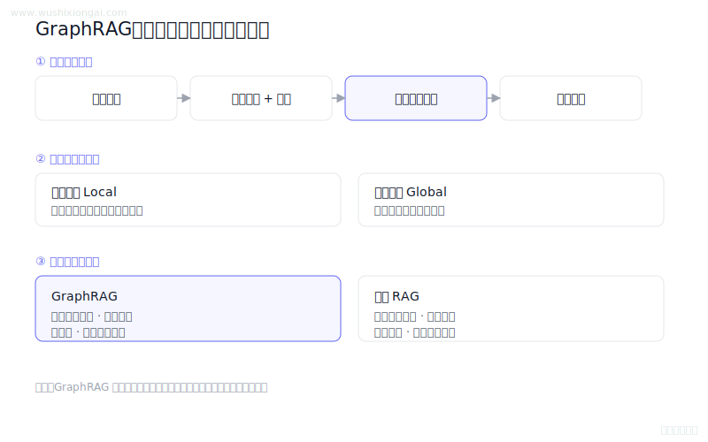
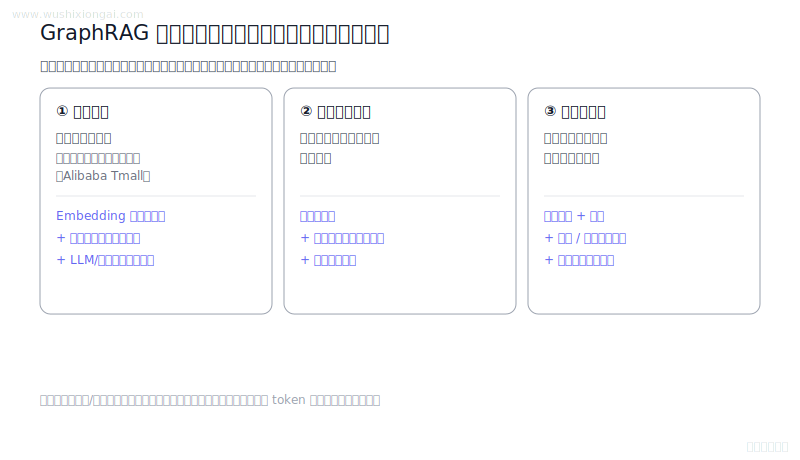

# 知识图谱图解（2 题）

GraphRAG、图检索与知识建模。本页摘要与图解均绑定正式答案哈希；答案或图解变化后，发布检查会要求重新复核。

[返回仓库首页](../README.md) · [在官网继续学习知识图谱](https://www.wushixiongai.com/knowledge-graph?utm_source=github&utm_medium=referral&utm_campaign=interview_100&utm_content=module-knowledge-graph)

### 01. GraphRAG 原理与构建方法

> **30 秒回答：** GraphRAG 从文档抽取实体关系、构建图和社区摘要，以局部关系检索与全局总结补充向量检索。
>
> **继续追问：** 实体消歧怎么做，社区粒度怎么评估，GraphRAG 如何支持增量更新。

**复核：** 2026-07-19 · **来源等级：** C · 教学整理

[在官网查看「GraphRAG 原理与构建方法」的完整答案、口语讲法与连续追问](https://www.wushixiongai.com/q/knowledge-graph-graphrag-principle-vs-vector?utm_source=github&utm_medium=referral&utm_campaign=interview_100&utm_content=question-rag-q0009)

---

### 02. GraphRAG 知识图谱构建有哪些挑战?

> **30 秒回答：** GraphRAG可靠性取决于实体消歧、关系溯源、版本化更新、安全隔离和分层评估，而非图结构本身。
>
> **继续追问：** 可继续讨论实体消歧、社区摘要失真和增量重算。

**复核：** 2026-07-19 · **来源等级：** B · 附可核验资料

**参考资料：**
- [From Local to Global: A Graph RAG Approach to Query-Focused Summarization](<https://arxiv.org/abs/2404.16130>)
- [Microsoft GraphRAG](<https://github.com/microsoft/graphrag>)

[在官网查看「GraphRAG 知识图谱构建有哪些挑战?」的完整答案、口语讲法与连续追问](https://www.wushixiongai.com/q/knowledge-graph-graphrag-entity-alignment-challenges?utm_source=github&utm_medium=referral&utm_campaign=interview_100&utm_content=question-rag-q0202)

---

[返回仓库首页](../README.md) · [在官网继续学习知识图谱](https://www.wushixiongai.com/knowledge-graph?utm_source=github&utm_medium=referral&utm_campaign=interview_100&utm_content=module-knowledge-graph)
