# 模型架构图解（20 题）

注意力、位置编码、归一化与模型结构。本页摘要与图解均绑定正式答案哈希；答案或图解变化后，发布检查会要求重新复核。

[返回仓库首页](../README.md) · [在官网继续学习模型架构](https://www.wushixiongai.com/transformer?utm_source=github&utm_medium=referral&utm_campaign=interview_100&utm_content=module-model-architecture)

### 01. BERT+CRF 怎么联合训练?

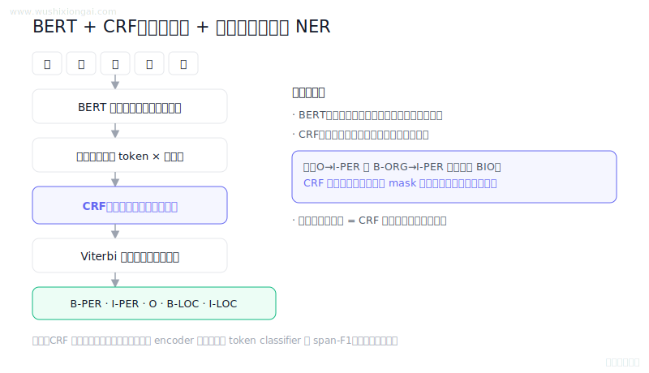

> **30 秒回答：** BERT产生上下文发射分数，CRF用标签转移分数联合解码序列，从而建模合法标注依赖。
>
> **继续追问：** 如何在 forward 和 Viterbi 中屏蔽非法转移，并验证 constrained CRF 的代价与收益？

**复核：** 2026-07-19 · **来源等级：** B · 附可核验资料

**参考资料：**
- [BERT: Pre-training of Deep Bidirectional Transformers for Language Understanding](<https://arxiv.org/abs/1810.04805>)
- [Neural Architectures for Named Entity Recognition](<https://arxiv.org/abs/1603.01360>)

[在官网查看「BERT+CRF 怎么联合训练?」的完整答案、口语讲法与连续追问](https://www.wushixiongai.com/q/arch-bert-crf-ner?utm_source=github&utm_medium=referral&utm_campaign=interview_100&utm_content=question-arch-bert-struct-q0276)

---

### 02. Decoder-only 架构为何是主流?

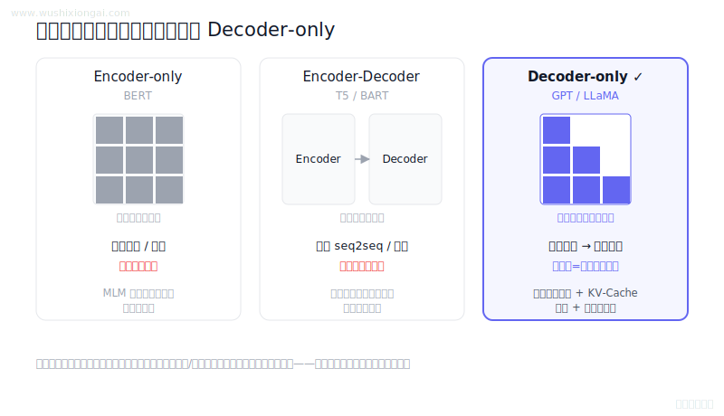

> **30 秒回答：** Decoder-only 以统一因果语言建模覆盖多种生成任务，训练可并行、解码可复用 KV Cache，工程扩展简单，但不在所有任务上优于其他架构。
>
> **继续追问：** prefill/decode 的复杂度、PagedAttention 或 GQA 如何缓解缓存瓶颈。

**复核：** 2026-07-19 · **来源等级：** B · 附可核验资料

**参考资料：**
- [Attention Is All You Need](<https://arxiv.org/abs/1706.03762>)
- [Language Models are Few-Shot Learners](<https://arxiv.org/abs/2005.14165>)
- [FlashAttention: Fast and Memory-Efficient Exact Attention with IO-Awareness](<https://arxiv.org/abs/2205.14135>)

[在官网查看「Decoder-only 架构为何是主流?」的完整答案、口语讲法与连续追问](https://www.wushixiongai.com/q/arch-decoder-only-rationale?utm_source=github&utm_medium=referral&utm_campaign=interview_100&utm_content=question-arch-decoder-only-q0294)

---

### 03. GPT vs BERT 核心区别在哪?

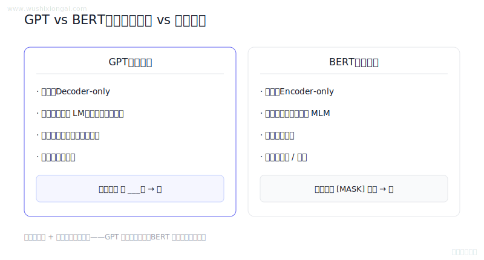

> **30 秒回答：** GPT 类采用 Decoder-only 自回归目标，适合生成；BERT 类采用 Encoder-only 双向表示，适合分类、抽取和检索编码，但两者边界并非绝对。
>
> **继续追问：** encoder-decoder 在条件生成上的优势，或 BERT 如何微调成 NLI/事实一致性分类器。

**复核：** 2026-07-19 · **来源等级：** B · 附可核验资料

**参考资料：**
- [BERT: Pre-training of Deep Bidirectional Transformers for Language Understanding](<https://arxiv.org/abs/1810.04805>)
- [Language Models are Unsupervised Multitask Learners](<https://cdn.openai.com/better-language-models/language_models_are_unsupervised_multitask_learners.pdf>)
- [Language Models are Few-Shot Learners](<https://arxiv.org/abs/2005.14165>)

[在官网查看「GPT vs BERT 核心区别在哪?」的完整答案、口语讲法与连续追问](https://www.wushixiongai.com/q/arch-gpt-vs-bert-comparison?utm_source=github&utm_medium=referral&utm_campaign=interview_100&utm_content=question-arch-gpt-vs-bert-q0123)

---

### 04. MLA 与 KV Cache 怎么用?

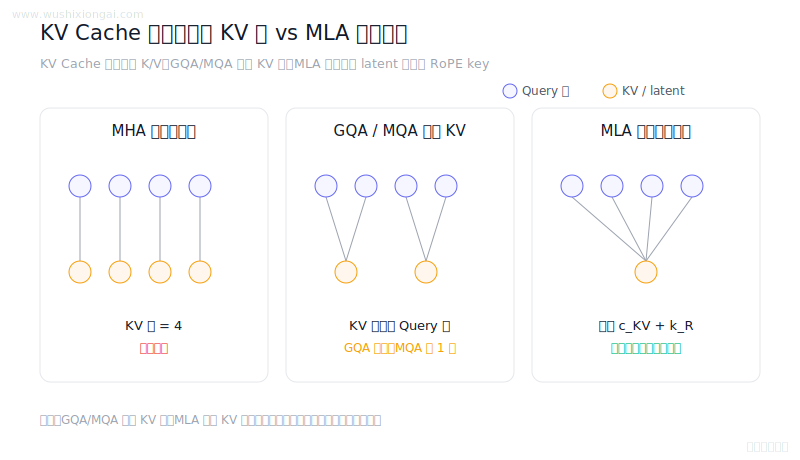

> **30 秒回答：** KV Cache 复用历史 K/V；GQA 和 MQA 通过共享 KV 头缩减缓存，MLA 则缓存低秩 latent 与解耦 RoPE key。
>
> **继续追问：** 可继续讨论矩阵吸收、缓存字节数推导，以及 MLA 与 GQA 在 kernel 和模型质量上的取舍。

**复核：** 2026-07-19 · **来源等级：** B · 附可核验资料

**参考资料：**
- [DeepSeek-V2: A Strong, Economical, and Efficient Mixture-of-Experts Language Model](<https://arxiv.org/abs/2405.04434>)
- [GQA: Training Generalized Multi-Query Transformer Models from Multi-Head Checkpoints](<https://arxiv.org/abs/2305.13245>)
- [Fast Transformer Decoding: One Write-Head is All You Need](<https://arxiv.org/abs/1911.02150>)

[在官网查看「MLA 与 KV Cache 怎么用?」的完整答案、口语讲法与连续追问](https://www.wushixiongai.com/q/arch-multi-head-latent-attention?utm_source=github&utm_medium=referral&utm_campaign=interview_100&utm_content=question-arch-gqa-mqa-mla-q0392)

---

### 05. 多头注意力原理与QKV拆分陷阱

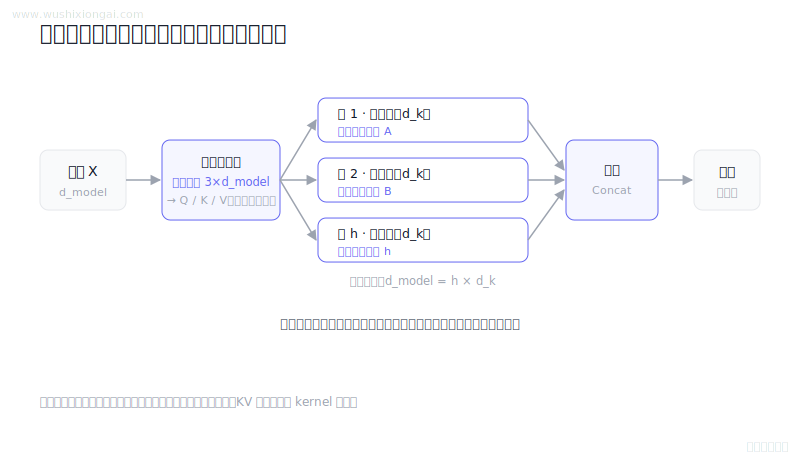

> **30 秒回答：** 多头注意力将 Q/K/V 拆到多个投影子空间并行计算后拼接输出，可形成多样注意力模式；头数、头维和内存布局需共同按质量与硬件验证。
>
> **继续追问：** 可继续讨论位置频率、缩放方法、长上下文评测和QKV融合kernel。

**复核：** 2026-07-19 · **来源等级：** B · 附可核验资料

**参考资料：**
- [Attention Is All You Need](<https://arxiv.org/abs/1706.03762>)
- [RoFormer: Enhanced Transformer with Rotary Position Embedding](<https://arxiv.org/abs/2104.09864>)

[在官网查看「多头注意力原理与QKV拆分陷阱」的完整答案、口语讲法与连续追问](https://www.wushixiongai.com/q/arch-multi-head-attention-implementation?utm_source=github&utm_medium=referral&utm_campaign=interview_100&utm_content=question-arch-mha-principle-q0245)

---

### 06. 位置编码为什么重要?

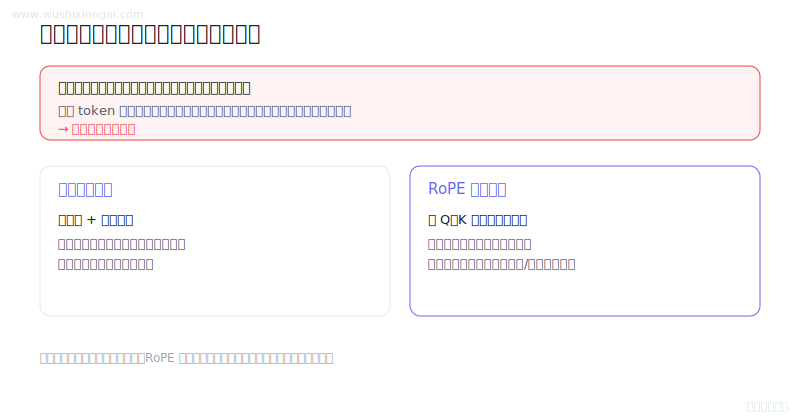

> **30 秒回答：** 位置编码为自注意力注入顺序与距离信号；RoPE 通过旋转 Q/K 编码相对位移，扩窗仍需缩放、训练和目标长度验证。
>
> **继续追问：** 可继续推导 RoPE 相对位置性质，或设计 position interpolation 的短长文本回归。

**复核：** 2026-07-19 · **来源等级：** B · 附可核验资料

**参考资料：**
- [Attention Is All You Need](<https://arxiv.org/abs/1706.03762>)
- [RoFormer: Enhanced Transformer with Rotary Position Embedding](<https://arxiv.org/abs/2104.09864>)
- [Extending Context Window of Large Language Models via Positional Interpolation](<https://arxiv.org/abs/2306.15595>)
- [YaRN: Efficient Context Window Extension of Large Language Models](<https://arxiv.org/abs/2309.00071>)

[在官网查看「位置编码为什么重要?」的完整答案、口语讲法与连续追问](https://www.wushixiongai.com/q/arch-positional-encoding-importance?utm_source=github&utm_medium=referral&utm_campaign=interview_100&utm_content=question-arch-q0138)

---

### 07. LLaMA为何选RMSNorm?

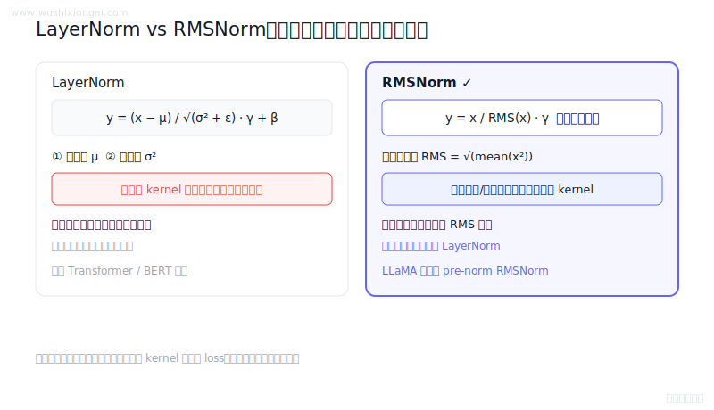

> **30 秒回答：** LayerNorm与RMSNorm的核心差异是是否减均值，归一化收益与稳定性需按模型和硬件验证。
>
> **继续追问：** 可继续讨论张量并行切分、融合kernel、FP32统计累积和Pre-Norm训练稳定性。

**复核：** 2026-07-19 · **来源等级：** B · 附可核验资料

**参考资料：**
- [Root Mean Square Layer Normalization](<https://arxiv.org/abs/1910.07467>)
- [LLaMA: Open and Efficient Foundation Language Models](<https://arxiv.org/abs/2302.13971>)
- [Layer Normalization](<https://arxiv.org/abs/1607.06450>)

[在官网查看「LLaMA为何选RMSNorm?」的完整答案、口语讲法与连续追问](https://www.wushixiongai.com/q/arch-layernorm-vs-rmsnorm-tradeoffs?utm_source=github&utm_medium=referral&utm_campaign=interview_100&utm_content=question-arch-q0147)

---

### 08. DDPM 为什么随机采样时间步?

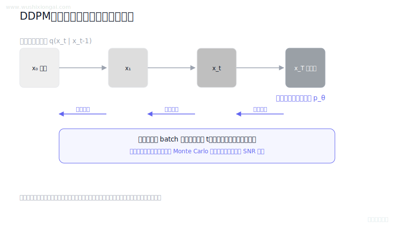

> **30 秒回答：** 扩散模型通过随机时间步的噪声预测损失做蒙特卡洛估计，从而学习各噪声阶段的反向去噪过程。
>
> **继续追问：** 如何根据各时间步损失方差设计采样分布，并推导对应的重加权系数？

**复核：** 2026-07-19 · **来源等级：** B · 附可核验资料

**参考资料：**
- [Denoising Diffusion Probabilistic Models](<https://arxiv.org/abs/2006.11239>)
- [Improved Denoising Diffusion Probabilistic Models](<https://arxiv.org/abs/2102.09672>)

[在官网查看「DDPM 为什么随机采样时间步?」的完整答案、口语讲法与连续追问](https://www.wushixiongai.com/q/train-ddpm-timestep-sampling-rationale?utm_source=github&utm_medium=referral&utm_campaign=interview_100&utm_content=question-arch-q0149)

---

### 09. RMSNorm vs LayerNorm：训练效率怎么比?

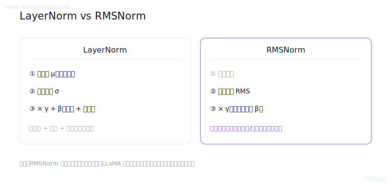

> **30 秒回答：** LayerNorm 同时中心化和缩放，RMSNorm 只按均方根缩放；后者统计量更少且被 LLaMA 采用，但性能与稳定性需按实现实测。
>
> **继续追问：** 可继续讨论归约kernel、张量并行通信和混合精度累积。

**复核：** 2026-07-19 · **来源等级：** B · 附可核验资料

**参考资料：**
- [Root Mean Square Layer Normalization](<https://arxiv.org/abs/1910.07467>)
- [LLaMA: Open and Efficient Foundation Language Models](<https://arxiv.org/abs/2302.13971>)

[在官网查看「RMSNorm vs LayerNorm：训练效率怎么比?」的完整答案、口语讲法与连续追问](https://www.wushixiongai.com/q/arch-layernorm-rmsnorm-modern-models?utm_source=github&utm_medium=referral&utm_campaign=interview_100&utm_content=question-arch-q0151)

---

### 10. CNN/RNN/Transformer 怎么选?

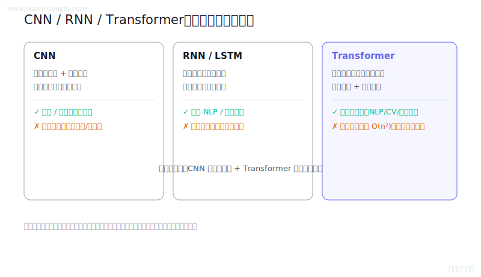

> **30 秒回答：** CNN、RNN与Transformer分别强调局部归纳偏置、递归状态和注意力交互，选型需按数据与硬件验证。
>
> **继续追问：** 可继续讨论流式推理、长上下文复杂度和混合架构的基准设计。

**复核：** 2026-07-19 · **来源等级：** B · 附可核验资料

**参考资料：**
- [Long Short-Term Memory](<https://www.bioinf.jku.at/publications/older/2604.pdf>)
- [Attention Is All You Need](<https://arxiv.org/abs/1706.03762>)

[在官网查看「CNN/RNN/Transformer 怎么选?」的完整答案、口语讲法与连续追问](https://www.wushixiongai.com/q/arch-neural-network-types-overview?utm_source=github&utm_medium=referral&utm_campaign=interview_100&utm_content=question-arch-q0186)

---

### 11. 逻辑回归原理怎么理解?

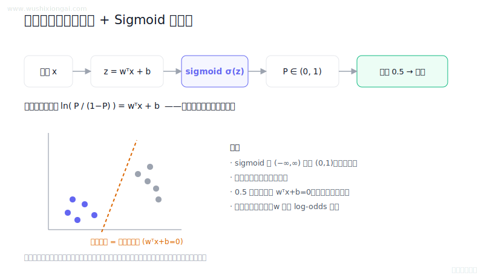

> **30 秒回答：** 逻辑回归对线性分数做sigmoid得到概率，决策边界由阈值对应的等概率超平面决定。
>
> **继续追问：** 可继续讨论最大似然不存在、正则化、校准和阈值选择。

**复核：** 2026-07-19 · **来源等级：** B · 附可核验资料

**参考资料：**
- [scikit-learn User Guide: Logistic Regression](<https://scikit-learn.org/stable/modules/linear_model.html#logistic-regression>)
- [statsmodels Discrete Choice Models Documentation](<https://www.statsmodels.org/stable/discretemod.html>)

[在官网查看「逻辑回归原理怎么理解?」的完整答案、口语讲法与连续追问](https://www.wushixiongai.com/q/arch-logistic-regression-principle?utm_source=github&utm_medium=referral&utm_campaign=interview_100&utm_content=question-arch-q0187)

---

### 12. 参数规模怎么影响大模型?

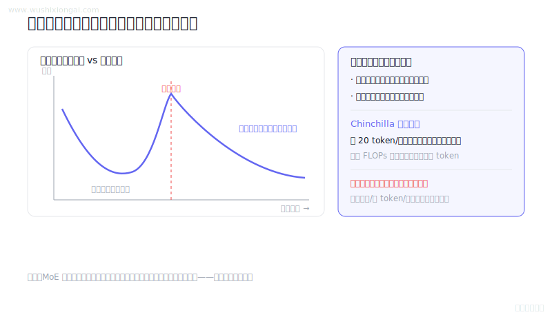

> **30 秒回答：** 参数规模扩大模型容量但不单独决定泛化，数据、计算、架构、正则和优化共同决定收益与稳定性。
>
> **继续追问：** 固定预训练 FLOPs 或固定上线成本时，怎样决定增加参数、训练 token 还是数据质量投入？

**复核：** 2026-07-19 · **来源等级：** B · 附可核验资料

**参考资料：**
- [Scaling Laws for Neural Language Models](<https://arxiv.org/abs/2001.08361>)
- [Training Compute-Optimal Large Language Models](<https://arxiv.org/abs/2203.15556>)
- [Deep Double Descent](<https://arxiv.org/abs/1912.02292>)

[在官网查看「参数规模怎么影响大模型?」的完整答案、口语讲法与连续追问](https://www.wushixiongai.com/q/arch-parameter-scale-generalization?utm_source=github&utm_medium=referral&utm_campaign=interview_100&utm_content=question-arch-q0221)

---

### 13. Encoder vs Decoder 功能区别?

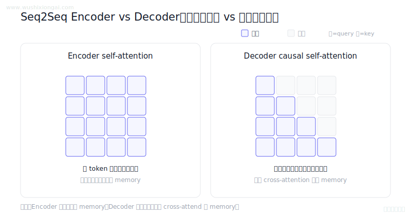

> **30 秒回答：** Seq2Seq Encoder 编码整段源序列为 memory，Decoder 对目标前缀做因果注意力并用交叉注意力读取该 memory。
>
> **继续追问：** 可继续讨论因果mask、exposure bias、KV缓存和Beam Search的长度偏置。

**复核：** 2026-07-19 · **来源等级：** B · 附可核验资料

**参考资料：**
- [Attention Is All You Need](<https://arxiv.org/abs/1706.03762>)
- [Sequence to Sequence Learning with Neural Networks](<https://arxiv.org/abs/1409.3215>)
- [Scheduled Sampling for Sequence Prediction with Recurrent Neural Networks](<https://arxiv.org/abs/1506.03099>)

[在官网查看「Encoder vs Decoder 功能区别?」的完整答案、口语讲法与连续追问](https://www.wushixiongai.com/q/arch-encoder-vs-decoder-roles?utm_source=github&utm_medium=referral&utm_campaign=interview_100&utm_content=question-arch-q0227)

---

### 14. MoE 怎么提升 Agent 能力?

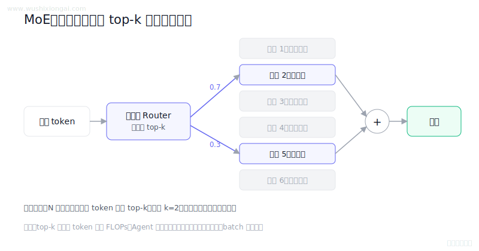

> **30 秒回答：** 稀疏 MoE 让路由器为每个 token 选择少量专家以控制激活计算；Agent 的实际收益仍受专家通信、负载均衡和外部编排影响。
>
> **继续追问：** 可继续讨论all-to-all通信、专家负载以及编排层权限与回退。

**复核：** 2026-07-19 · **来源等级：** B · 附可核验资料

**参考资料：**
- [Switch Transformers](<https://arxiv.org/abs/2101.03961>)
- [GShard](<https://arxiv.org/abs/2006.16668>)
- [ReAct: Synergizing Reasoning and Acting in Language Models](<https://arxiv.org/abs/2210.03629>)

[在官网查看「MoE 怎么提升 Agent 能力?」的完整答案、口语讲法与连续追问](https://www.wushixiongai.com/q/arch-moe-for-agent-capabilities?utm_source=github&utm_medium=referral&utm_campaign=interview_100&utm_content=question-arch-q0250)

---

### 15. VQ-VAE 原理与完整结构

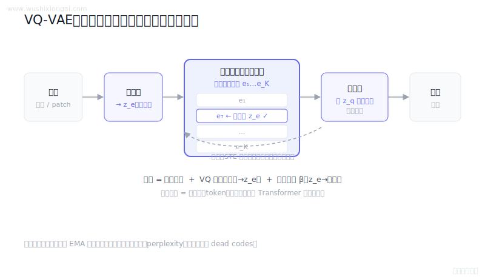

> **30 秒回答：** VQ-VAE用离散码本量化编码表示，并联合优化重建、码本与承诺损失。
>
> **继续追问：** 如何通过 latent 使用率、码本 perplexity 和重建消融区分这两类坍塌？

**复核：** 2026-07-19 · **来源等级：** B · 附可核验资料

**参考资料：**
- [Neural Discrete Representation Learning](<https://arxiv.org/abs/1711.00937>)

[在官网查看「VQ-VAE 原理与完整结构」的完整答案、口语讲法与连续追问](https://www.wushixiongai.com/q/arch-vqvae-principle-structure?utm_source=github&utm_medium=referral&utm_campaign=interview_100&utm_content=question-arch-q0262)

---

### 16. RMSNorm vs LayerNorm：数值稳定性怎么比?

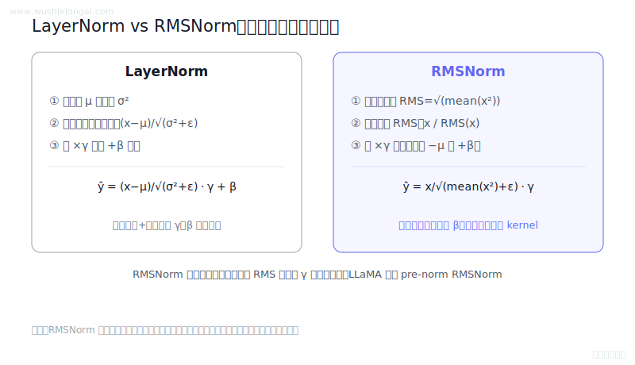

> **30 秒回答：** LayerNorm执行中心化与方差归一化，RMSNorm只按均方根缩放，实际效率与稳定性需基准验证。
>
> **继续追问：** 怎样设计同等初始化与精度下的 LayerNorm/RMSNorm 消融，并判断稳定性差异来自哪里？

**复核：** 2026-07-19 · **来源等级：** B · 附可核验资料

**参考资料：**
- [Root Mean Square Layer Normalization](<https://arxiv.org/abs/1910.07467>)
- [Layer Normalization](<https://arxiv.org/abs/1607.06450>)
- [LLaMA: Open and Efficient Foundation Language Models](<https://arxiv.org/abs/2302.13971>)

[在官网查看「RMSNorm vs LayerNorm：数值稳定性怎么比?」的完整答案、口语讲法与连续追问](https://www.wushixiongai.com/q/arch-layernorm-rmsnorm-comparison?utm_source=github&utm_medium=referral&utm_campaign=interview_100&utm_content=question-arch-q0274)

---

### 17. VQ-VAE 码本塌缩治理

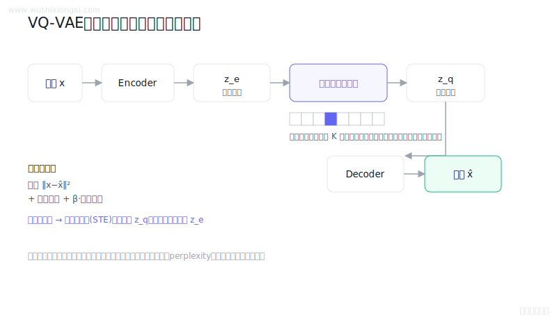

> **30 秒回答：** VQ-VAE死码源于编码分布和码本更新失衡，应监控码本占用与困惑度并按证据采用EMA或重置。
>
> **继续追问：** 可继续讨论EMA更新、commitment、dead codes、残差VQ和生成先验。

**复核：** 2026-07-19 · **来源等级：** B · 附可核验资料

**参考资料：**
- [Neural Discrete Representation Learning](<https://arxiv.org/abs/1711.00937>)
- [Taming Transformers for High-Resolution Image Synthesis](<https://arxiv.org/abs/2012.09841>)
- [High-Resolution Image Synthesis with Latent Diffusion Models](<https://arxiv.org/abs/2112.10752>)
- [SoundStream: An End-to-End Neural Audio Codec](<https://arxiv.org/abs/2107.03312>)

[在官网查看「VQ-VAE 码本塌缩治理」的完整答案、口语讲法与连续追问](https://www.wushixiongai.com/q/arch-vqvae-codebook-discrete-latent?utm_source=github&utm_medium=referral&utm_campaign=interview_100&utm_content=question-arch-q0310)

---

### 18. 自回归生成用 token id 还是概率分布?

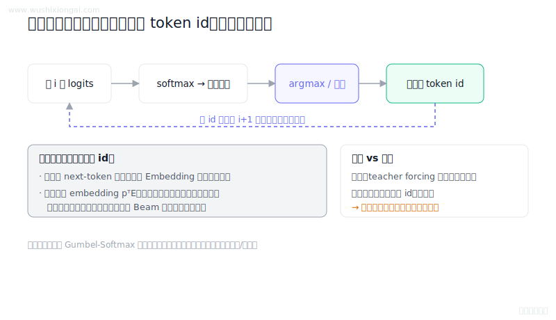

> **30 秒回答：** 自回归解码下一步输入已选离散token而非完整概率分布，采样策略只决定如何选择该token。
>
> **继续追问：** 可继续讨论训练分布偏移、Gumbel-Softmax、Beam状态和KV缓存复用。

**复核：** 2026-07-19 · **来源等级：** B · 附可核验资料

**参考资料：**
- [Attention Is All You Need](<https://arxiv.org/abs/1706.03762>)
- [Categorical Reparameterization with Gumbel-Softmax](<https://arxiv.org/abs/1611.01144>)
- [Scheduled Sampling for Sequence Prediction with Recurrent Neural Networks](<https://arxiv.org/abs/1506.03099>)

[在官网查看「自回归生成用 token id 还是概率分布?」的完整答案、口语讲法与连续追问](https://www.wushixiongai.com/q/arch-autoregressive-token-feeding?utm_source=github&utm_medium=referral&utm_campaign=interview_100&utm_content=question-arch-q0377)

---

### 19. Self-Attention 怎么计算 QKV?

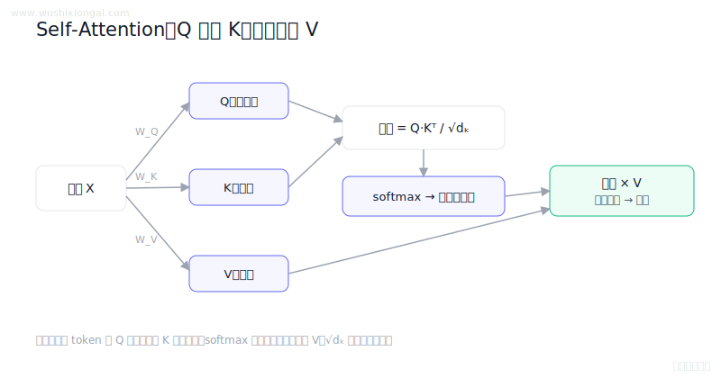

> **30 秒回答：** Self-Attention 将输入投影为 Q、K、V，以缩放点积和掩码生成权重，再对 V 加权聚合；多头版本在多个子空间并行计算。
>
> **继续追问：** 可继续讨论残差路径、干预实验、梯度归因和Attention is not Explanation。

**复核：** 2026-07-19 · **来源等级：** B · 附可核验资料

**参考资料：**
- [Attention Is All You Need](<https://arxiv.org/abs/1706.03762>)
- [Attention is not Explanation](<https://arxiv.org/abs/1902.10186>)
- [FlashAttention: Fast and Memory-Efficient Exact Attention with IO-Awareness](<https://arxiv.org/abs/2205.14135>)

[在官网查看「Self-Attention 怎么计算 QKV?」的完整答案、口语讲法与连续追问](https://www.wushixiongai.com/q/arch-self-attention-qkv-mechanism?utm_source=github&utm_medium=referral&utm_campaign=interview_100&utm_content=question-arch-self-attention-principle-q0010)

---

### 20. Transformer 架构核心组件原理

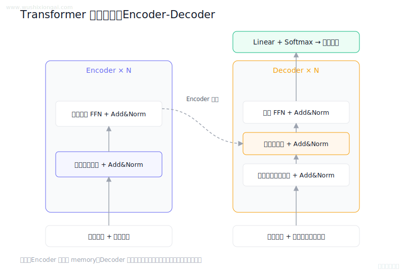

> **30 秒回答：** 原始 Transformer 由多层 Encoder 和 Decoder 组成，结合多头注意力、逐位置 FFN、残差归一化与位置编码。
>
> **继续追问：** 可继续讨论Pre/Post-Norm梯度、cross-attention和位置外推。

**复核：** 2026-07-19 · **来源等级：** B · 附可核验资料

**参考资料：**
- [Attention Is All You Need](<https://arxiv.org/abs/1706.03762>)
- [BERT](<https://arxiv.org/abs/1810.04805>)
- [Language Models are Few-Shot Learners](<https://arxiv.org/abs/2005.14165>)

[在官网查看「Transformer 架构核心组件原理」的完整答案、口语讲法与连续追问](https://www.wushixiongai.com/q/arch-transformer-overall-architecture?utm_source=github&utm_medium=referral&utm_campaign=interview_100&utm_content=question-arch-transformer-overall-q0040)

---

[返回仓库首页](../README.md) · [在官网继续学习模型架构](https://www.wushixiongai.com/transformer?utm_source=github&utm_medium=referral&utm_campaign=interview_100&utm_content=module-model-architecture)
