# 模型训练图解（11 题）

训练目标、优化过程、数据与稳定性。本页摘要与图解均绑定正式答案哈希；答案或图解变化后，发布检查会要求重新复核。

[返回仓库首页](../README.md) · [在官网继续学习模型训练](https://www.wushixiongai.com/finetune?utm_source=github&utm_medium=referral&utm_campaign=interview_100&utm_content=module-model-training)

### 01. KL散度本质与非对称性怎么用?

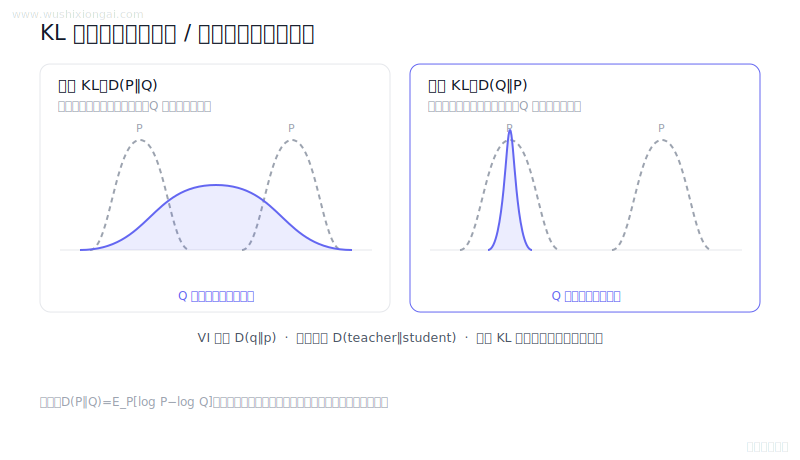

> **30 秒回答：** KL 散度是以一个分布加权的对数概率差，非负但不对称且不是距离；变分推断、蒸馏和策略约束采用的方向取决于目标与实现。
>
> **继续追问：** VAE 为何采用 q 到先验的 KL，或 RLHF 中逐 token KL 如何估计。

**复核：** 2026-07-19 · **来源等级：** B · 附可核验资料

**参考资料：**
- [Auto-Encoding Variational Bayes](<https://arxiv.org/abs/1312.6114>)
- [Distilling the Knowledge in a Neural Network](<https://arxiv.org/abs/1503.02531>)
- [Proximal Policy Optimization Algorithms](<https://arxiv.org/abs/1707.06347>)

[在官网查看「KL散度本质与非对称性怎么用?」的完整答案、口语讲法与连续追问](https://www.wushixiongai.com/q/arch-kl-divergence-applications?utm_source=github&utm_medium=referral&utm_campaign=interview_100&utm_content=question-arch-kl-divergence-q0096)

---

### 02. Flow Matching 原理是什么?

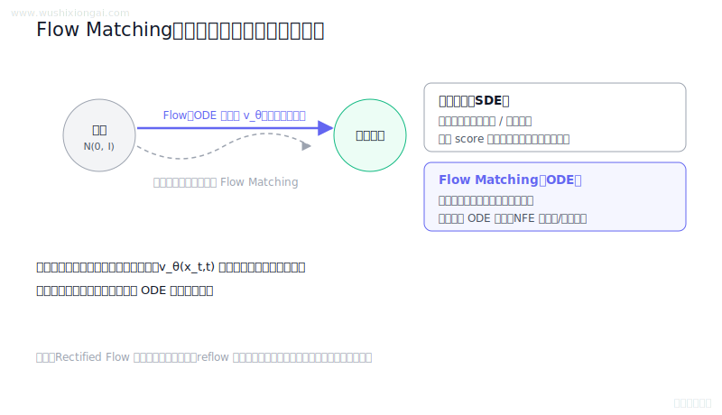

> **30 秒回答：** Flow Matching直接回归概率路径的条件速度场，并用常微分方程把基分布传输到数据分布。
>
> **继续追问：** Conditional Flow Matching 为何与边缘目标同梯度，或路径曲率如何影响采样 NFE。

**复核：** 2026-07-19 · **来源等级：** B · 附可核验资料

**参考资料：**
- [Flow Matching for Generative Modeling](<https://arxiv.org/abs/2210.02747>)
- [Flow Straight and Fast: Learning to Generate and Transfer Data with Rectified Flow](<https://arxiv.org/abs/2209.03003>)
- [Scaling Rectified Flow Transformers for High-Resolution Image Synthesis](<https://arxiv.org/abs/2403.03206>)

[在官网查看「Flow Matching 原理是什么?」的完整答案、口语讲法与连续追问](https://www.wushixiongai.com/q/train-flow-matching-principle?utm_source=github&utm_medium=referral&utm_campaign=interview_100&utm_content=question-train-flow-matching-q0304)

---

### 03. DDPM vs Flow Matching: 采样效率与优缺点?

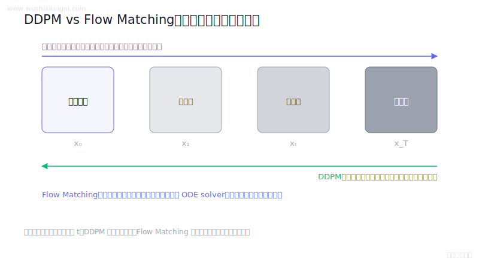

> **30 秒回答：** DDPM 学习离散反向去噪过程，Flow Matching 回归连续概率路径的速度场；两者训练都可随机采样时间，采样效率取决于路径与求解器。
>
> **继续追问：** diffusion path 下 Flow Matching 与 score/noise prediction 的参数化联系。

**复核：** 2026-07-19 · **来源等级：** B · 附可核验资料

**参考资料：**
- [Denoising Diffusion Probabilistic Models](<https://arxiv.org/abs/2006.11239>)
- [Flow Matching for Generative Modeling](<https://arxiv.org/abs/2210.02747>)
- [Denoising Diffusion Implicit Models](<https://arxiv.org/abs/2010.02502>)

[在官网查看「DDPM vs Flow Matching: 采样效率与优缺点?」的完整答案、口语讲法与连续追问](https://www.wushixiongai.com/q/train-ddpm-vs-flow-matching?utm_source=github&utm_medium=referral&utm_campaign=interview_100&utm_content=question-train-q0021)

---

### 04. PyTorch 动态图怎么自动微分?

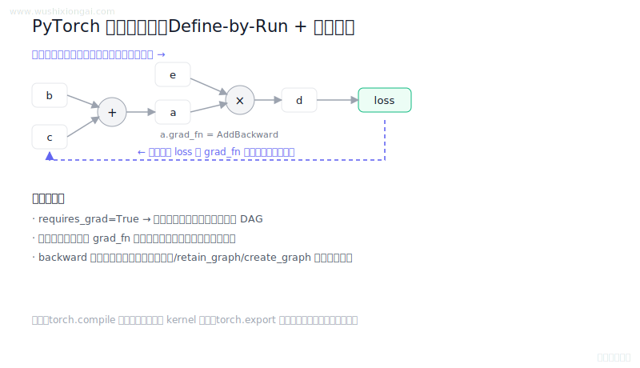

> **30 秒回答：** PyTorch在前向执行时动态记录自动微分图，反向按链式法则累积梯度并在下一轮重新建图。
>
> **继续追问：** retain_graph 与 create_graph 的区别，或分析一次 graph break 和重新编译。

**复核：** 2026-07-19 · **来源等级：** B · 附可核验资料

**参考资料：**
- [PyTorch Autograd Mechanics](<https://docs.pytorch.org/docs/stable/notes/autograd.html>)
- [torch.autograd.backward Documentation](<https://docs.pytorch.org/docs/stable/generated/torch.autograd.backward.html>)
- [torch.compile Documentation](<https://docs.pytorch.org/docs/stable/generated/torch.compile.html>)
- [torch.export Documentation](<https://docs.pytorch.org/docs/stable/export.html>)

[在官网查看「PyTorch 动态图怎么自动微分?」的完整答案、口语讲法与连续追问](https://www.wushixiongai.com/q/train-pytorch-dynamic-graph-autograd?utm_source=github&utm_medium=referral&utm_campaign=interview_100&utm_content=question-train-q0160)

---

### 05. Focal Loss 公式与作用机制

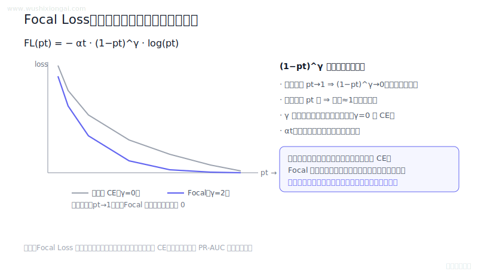

> **30 秒回答：** Focal Loss用调制因子降低易样本权重并聚焦难样本，类别权重和聚焦参数需按噪声与校准验证。
>
> **继续追问：** alpha 与 gamma 如何联合调参，以及标签噪声为何可能取得更高相对贡献。

**复核：** 2026-07-19 · **来源等级：** B · 附可核验资料

**参考资料：**
- [Focal Loss for Dense Object Detection](<https://arxiv.org/abs/1708.02002>)

[在官网查看「Focal Loss 公式与作用机制」的完整答案、口语讲法与连续追问](https://www.wushixiongai.com/q/train-focal-loss-class-imbalance?utm_source=github&utm_medium=referral&utm_campaign=interview_100&utm_content=question-train-q0200)

---

### 06. 训练曲线异常怎么排查？

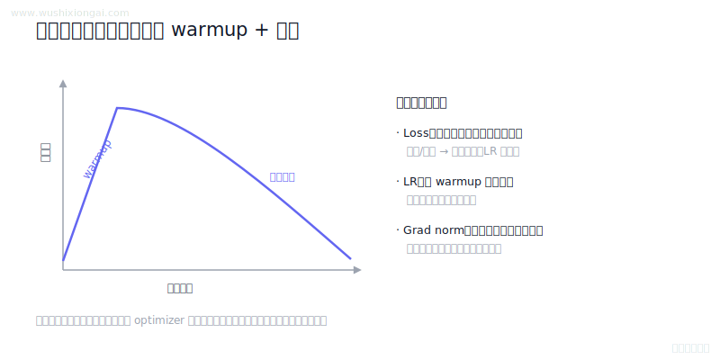

> **30 秒回答：** loss、学习率和梯度范数只是训练诊断线索，异常需要结合优化器状态、数据样本、历史基线、验证指标和可重放实验才能归因。
>
> **继续追问：** 可继续讨论更新范数、loss scaling、scheduler恢复和异常batch回放。

**复核：** 2026-07-19 · **来源等级：** B · 附可核验资料

**参考资料：**
- [PyTorch clip\_grad\_norm\_ documentation](<https://docs.pytorch.org/docs/stable/generated/torch.nn.utils.clip_grad_norm_.html>)
- [Hugging Face Trainer documentation](<https://huggingface.co/docs/transformers/main_classes/trainer>)

[在官网查看「训练曲线异常怎么排查？」的完整答案、口语讲法与连续追问](https://www.wushixiongai.com/q/train-training-curves-interpretation?utm_source=github&utm_medium=referral&utm_campaign=interview_100&utm_content=question-train-q0248)

---

### 07. SFT vs 预训练:核心区别在哪?

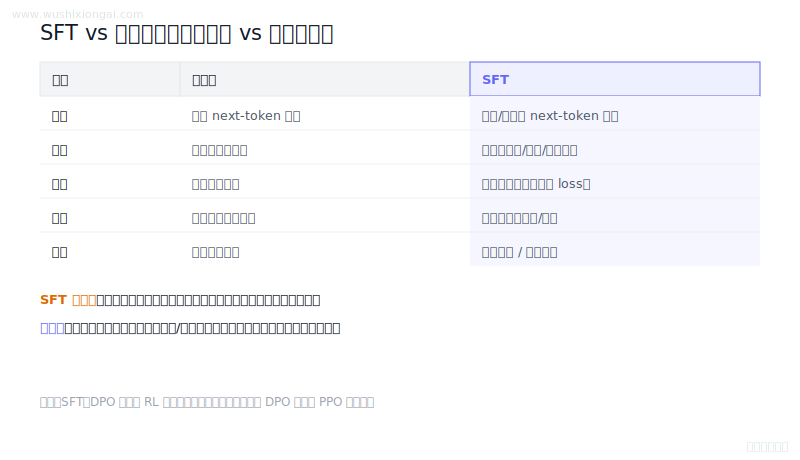

> **30 秒回答：** 预训练与SFT常共享下一token损失，差异主要在数据与监督范围，复读需从数据和解码共同治理。
>
> **继续追问：** 可继续展开 assistant-only loss、灾难性遗忘诊断或 SFT 与偏好优化的消融设计。

**复核：** 2026-07-19 · **来源等级：** B · 附可核验资料

**参考资料：**
- [Training language models to follow instructions with human feedback](<https://arxiv.org/abs/2203.02155>)
- [LIMA: Less Is More for Alignment](<https://arxiv.org/abs/2305.11206>)
- [Direct Preference Optimization: Your Language Model is Secretly a Reward Model](<https://arxiv.org/abs/2305.18290>)

[在官网查看「SFT vs 预训练:核心区别在哪?」的完整答案、口语讲法与连续追问](https://www.wushixiongai.com/q/train-sft-vs-pretraining-differences?utm_source=github&utm_medium=referral&utm_campaign=interview_100&utm_content=question-train-q0333)

---

### 08. MSE vs 交叉熵损失怎么选?

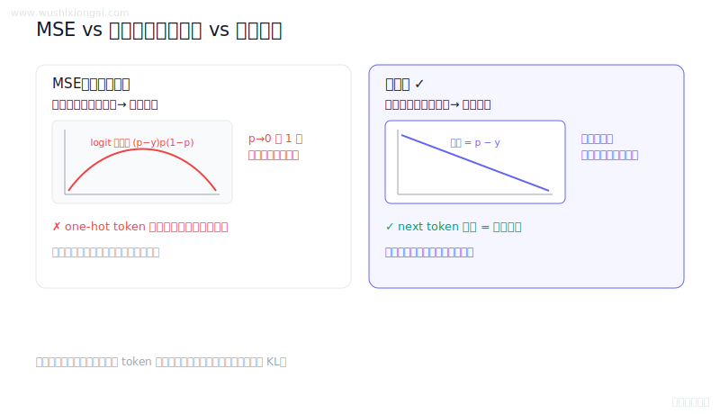

> **30 秒回答：** 均方误差适合连续回归，交叉熵对应分类似然并提供更合适梯度，因此语言建模通常采用交叉熵。
>
> **继续追问：** 可继续现场推导 sigmoid 加 BCE 的梯度，或讨论 softmax 数值稳定实现。

**复核：** 2026-07-19 · **来源等级：** B · 附可核验资料

**参考资料：**
- [PyTorch MSELoss Documentation](<https://docs.pytorch.org/docs/stable/generated/torch.nn.MSELoss.html>)
- [PyTorch CrossEntropyLoss Documentation](<https://docs.pytorch.org/docs/stable/generated/torch.nn.CrossEntropyLoss.html>)
- [A Fast Learning Algorithm for Deep Belief Nets](<https://www.cs.toronto.edu/~hinton/absps/fastnc.pdf>)

[在官网查看「MSE vs 交叉熵损失怎么选?」的完整答案、口语讲法与连续追问](https://www.wushixiongai.com/q/train-mse-vs-cross-entropy?utm_source=github&utm_medium=referral&utm_campaign=interview_100&utm_content=question-train-q0368)

---

### 09. 模型收敛怎么判断?

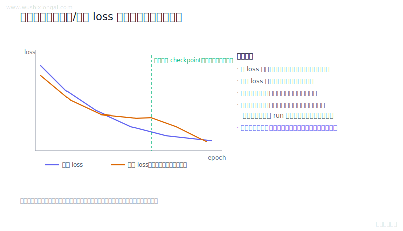

> **30 秒回答：** 收敛需结合训练损失、梯度统计、独立验证指标和多次评测判断，单一曲线趋平不能证明泛化。
>
> **继续追问：** 可继续讨论更新范数、评测噪声、早停patience和学习率阶段。

**复核：** 2026-07-19 · **来源等级：** B · 附可核验资料

**参考资料：**
- [PyTorch clip\_grad\_norm\_ documentation](<https://docs.pytorch.org/docs/stable/generated/torch.nn.utils.clip_grad_norm_.html>)
- [Hugging Face Trainer documentation](<https://huggingface.co/docs/transformers/main_classes/trainer>)

[在官网查看「模型收敛怎么判断?」的完整答案、口语讲法与连续追问](https://www.wushixiongai.com/q/train-convergence-judgment-metrics?utm_source=github&utm_medium=referral&utm_campaign=interview_100&utm_content=question-train-q0394)

---

### 10. SFT 后置信度下降原因

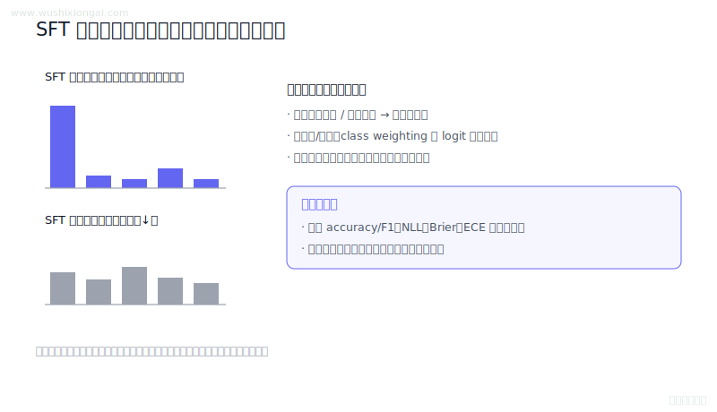

> **30 秒回答：** SFT后置信度变平不等于性能下降，应联合准确率、NLL、Brier、ECE和分桶漂移诊断原因。
>
> **继续追问：** ECE/Brier 的计算、temperature 拟合，或如何从 logit margin 定位原因。

**复核：** 2026-07-19 · **来源等级：** B · 附可核验资料

**参考资料：**
- [On Calibration of Modern Neural Networks](<https://proceedings.mlr.press/v70/guo17a.html>)
- [Rethinking the Inception Architecture for Computer Vision (Label Smoothing)](<https://arxiv.org/abs/1512.00567>)
- [When Does Label Smoothing Help?](<https://arxiv.org/abs/1906.02629>)

[在官网查看「SFT 后置信度下降原因」的完整答案、口语讲法与连续追问](https://www.wushixiongai.com/q/train-sft-confidence-drop-causes?utm_source=github&utm_medium=referral&utm_campaign=interview_100&utm_content=question-train-q0403)

---

### 11. 重参数化技巧怎么解决梯度问题?

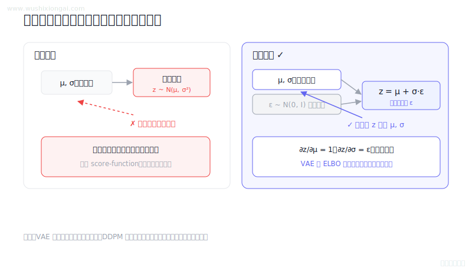

> **30 秒回答：** 重参数化把随机变量写成参数与独立噪声的可微函数，使路径梯度能够通过采样计算。
>
> **继续追问：** 直通估计、Gumbel-Softmax 和 score-function 在偏差、方差与实现上怎样取舍？

**复核：** 2026-07-19 · **来源等级：** B · 附可核验资料

**参考资料：**
- [Auto-Encoding Variational Bayes](<https://arxiv.org/abs/1312.6114>)
- [Denoising Diffusion Probabilistic Models](<https://arxiv.org/abs/2006.11239>)

[在官网查看「重参数化技巧怎么解决梯度问题?」的完整答案、口语讲法与连续追问](https://www.wushixiongai.com/q/train-reparameterization-trick?utm_source=github&utm_medium=referral&utm_campaign=interview_100&utm_content=question-train-reparameterization-q0063)

---

[返回仓库首页](../README.md) · [在官网继续学习模型训练](https://www.wushixiongai.com/finetune?utm_source=github&utm_medium=referral&utm_campaign=interview_100&utm_content=module-model-training)
