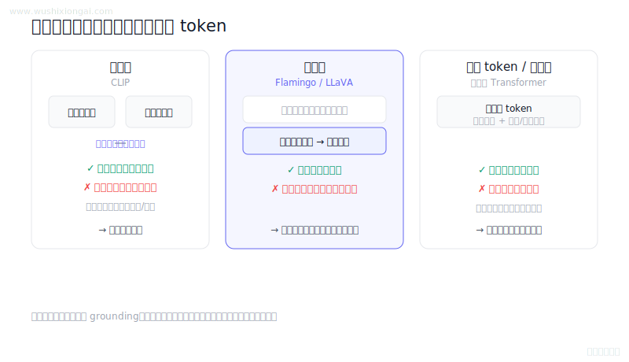
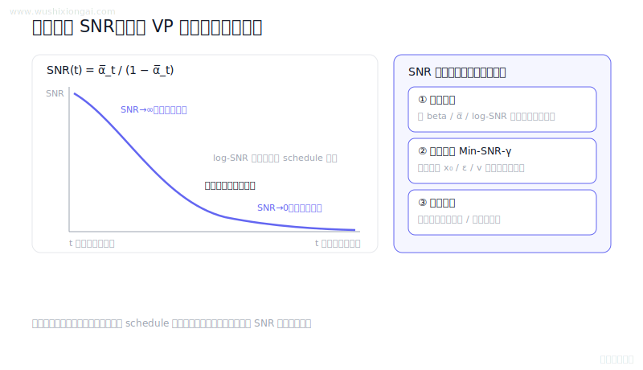
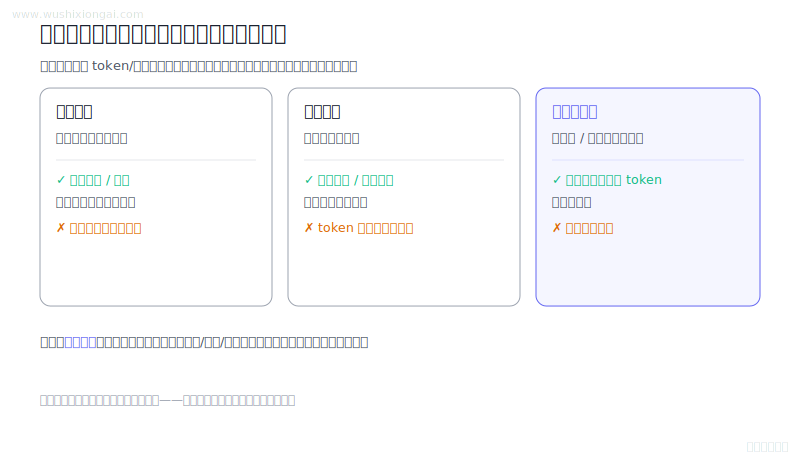
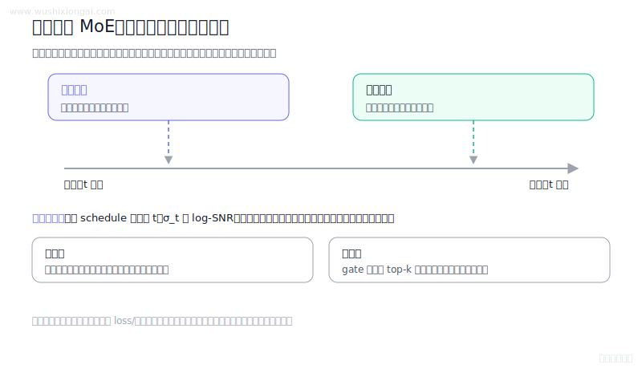
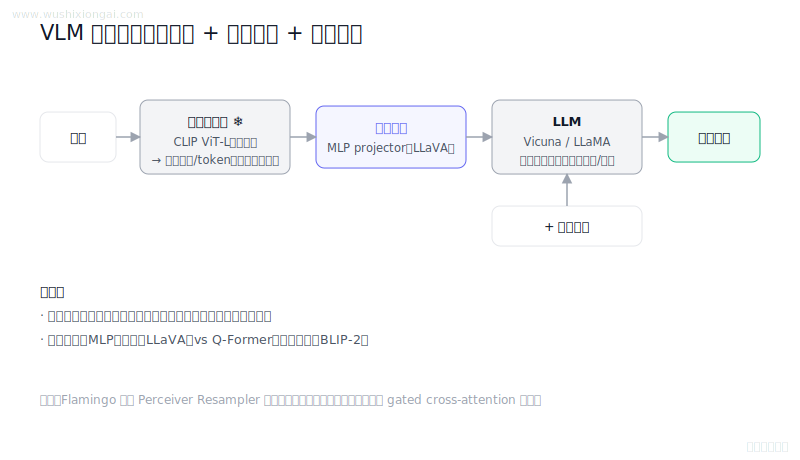
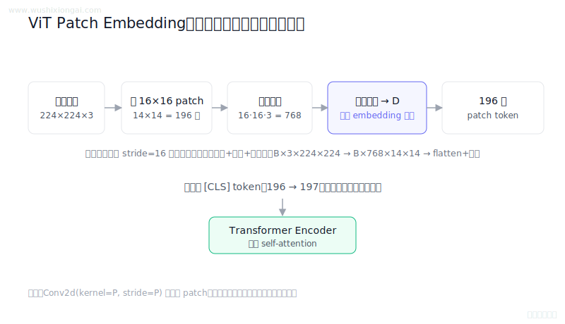
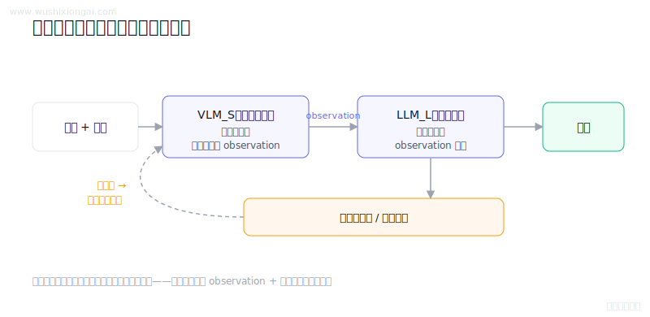

# 多模态图解（8 题）

视觉语言模型、对齐与多模态检索。本页摘要与图解均绑定正式答案哈希；答案或图解变化后，发布检查会要求重新复核。

[返回仓库首页](../README.md) · [在官网继续学习多模态](https://www.wushixiongai.com/multimodal?utm_source=github&utm_medium=referral&utm_campaign=interview_100&utm_content=module-multimodal)

### 01. 多模态大模型怎么理解？

> **30 秒回答：** 多模态架构应按编码器、连接器、训练数据、分辨率、延迟和目标任务评测，不宜作无条件排名。
>
> **继续追问：** 可继续讨论Q-Former、Perceiver Resampler、projector和对比学习目标的差异。

**复核：** 2026-07-19 · **来源等级：** B · 附可核验资料

**参考资料：**
- [Learning Transferable Visual Models From Natural Language Supervision](<https://arxiv.org/abs/2103.00020>)
- [Flamingo: a Visual Language Model for Few-Shot Learning](<https://arxiv.org/abs/2204.14198>)
- [Qwen-VL: A Versatile Vision-Language Model for Understanding, Localization, Text Reading, and Beyond](<https://arxiv.org/abs/2308.12966>)
- [BLIP-2: Bootstrapping Language-Image Pre-training with Frozen Image Encoders and Large Language Models](<https://arxiv.org/abs/2301.12597>)

[在官网查看「多模态大模型怎么理解？」的完整答案、口语讲法与连续追问](https://www.wushixiongai.com/q/multimodal-architecture-representative-models?utm_source=github&utm_medium=referral&utm_campaign=interview_100&utm_content=question-mm-overall-q0092)

---

### 02. 扩散模型 SNR 怎么用?

> **30 秒回答：** 扩散模型信噪比由信号与噪声系数之比定义，可用于时间步采样、损失加权、调度和条件路由。
>
> **继续追问：** 可继续推导目标参数化换算、梯度尺度和v预测权重。

**复核：** 2026-07-19 · **来源等级：** B · 附可核验资料

**参考资料：**
- [Denoising Diffusion Probabilistic Models](<https://arxiv.org/abs/2006.11239>)
- [Improved Denoising Diffusion Probabilistic Models](<https://arxiv.org/abs/2102.09672>)
- [Efficient Diffusion Training via Min-SNR Weighting Strategy](<https://arxiv.org/abs/2303.09556>)

[在官网查看「扩散模型 SNR 怎么用?」的完整答案、口语讲法与连续追问](https://www.wushixiongai.com/q/train-diffusion-snr-scheduling?utm_source=github&utm_medium=referral&utm_campaign=interview_100&utm_content=question-mm-q0266)

---

### 03. 均匀采样vs关键帧如何影响模型？

> **30 秒回答：** 视频采帧应在视觉token预算内按任务选择均匀、随机、场景或事件驱动策略并保留关键时序证据。
>
> **继续追问：** 可继续讨论事件遗漏率、粗到细检索、时间位置编码和视觉token预算。

**复核：** 2026-07-19 · **来源等级：** B · 附可核验资料

**参考资料：**
- [Is Space-Time Attention All You Need for Video Understanding?](<https://arxiv.org/abs/2102.05095>)
- [VideoMAE: Masked Autoencoders are Data-Efficient Learners for Self-Supervised Video Pre-Training](<https://arxiv.org/abs/2203.12602>)
- [PySceneDetect Documentation](<https://www.scenedetect.com/docs/latest/>)

[在官网查看「均匀采样vs关键帧如何影响模型？」的完整答案、口语讲法与连续追问](https://www.wushixiongai.com/q/multimodal-video-frame-sampling-selection?utm_source=github&utm_medium=referral&utm_campaign=interview_100&utm_content=question-mm-q0473)

---

### 04. MoE 专家网络怎么动态路由?

> **30 秒回答：** 扩散MoE可按时间步、噪声尺度或log-SNR路由专家，内容条件与软硬路由需验证负载和质量。
>
> **继续追问：** 可继续讨论等参数量消融、专家利用率、分噪声桶评测和路由塌缩。

**复核：** 2026-07-19 · **来源等级：** B · 附可核验资料

**参考资料：**
- [Denoising Diffusion Probabilistic Models](<https://arxiv.org/abs/2006.11239>)
- [eDiff-I: Text-to-Image Diffusion Models with an Ensemble of Expert Denoisers](<https://arxiv.org/abs/2211.01324>)

[在官网查看「MoE 专家网络怎么动态路由?」的完整答案、口语讲法与连续追问](https://www.wushixiongai.com/q/multimodal-diffusion-expert-selection?utm_source=github&utm_medium=referral&utm_campaign=interview_100&utm_content=question-mm-q0546)

---

### 05. 多模态大模型网络结构怎么搭?

> **30 秒回答：** LLaVA、BLIP-2与Qwen-VL都由视觉编码、连接模块和语言模型协作，但桥接与训练策略不同。
>
> **继续追问：** 可继续讨论视觉token压缩、cross-attention位置、冻结策略和视觉消融。

**复核：** 2026-07-19 · **来源等级：** B · 附可核验资料

**参考资料：**
- [Improved Baselines with Visual Instruction Tuning](<https://arxiv.org/abs/2310.03744>)
- [BLIP-2: Bootstrapping Language-Image Pre-training with Frozen Image Encoders and Large Language Models](<https://arxiv.org/abs/2301.12597>)
- [Flamingo: a Visual Language Model for Few-Shot Learning](<https://arxiv.org/abs/2204.14198>)

[在官网查看「多模态大模型网络结构怎么搭?」的完整答案、口语讲法与连续追问](https://www.wushixiongai.com/q/multimodal-vlm-network-structure?utm_source=github&utm_medium=referral&utm_campaign=interview_100&utm_content=question-mm-qwenvl-llava-q0365)

---

### 06. ViT 图像块嵌入原理与实现

> **30 秒回答：** ViT将图像划分为patch，经线性投影或等价卷积得到token，再加入位置表示和可选分类token。
>
> **继续追问：** 可继续讨论可变分辨率、位置embedding插值和层次化视觉Transformer。

**复核：** 2026-07-19 · **来源等级：** B · 附可核验资料

**参考资料：**
- [An Image is Worth 16x16 Words: Transformers for Image Recognition at Scale](<https://arxiv.org/abs/2010.11929>)

[在官网查看「ViT 图像块嵌入原理与实现」的完整答案、口语讲法与连续追问](https://www.wushixiongai.com/q/multimodal-vit-patch-embedding?utm_source=github&utm_medium=referral&utm_campaign=interview_100&utm_content=question-mm-vit-q0211)

---

### 07. Multi-modal RAG 原理与挑战

> **30 秒回答：** 多模态RAG对文本、图像、音视频分别编码和检索，并保留空间时间锚点以支持重排、生成与引用。
>
> **继续追问：** 可继续讨论共享嵌入、局部区域索引和跨模态重排。

**复核：** 2026-07-19 · **来源等级：** B · 附可核验资料

**参考资料：**
- [MuRAG: Multimodal Retrieval-Augmented Generator for Open Question Answering over Images and Text](<https://arxiv.org/abs/2210.02928>)
- [Retrieval-Augmented Multimodal Language Modeling](<https://arxiv.org/abs/2211.12561>)

[在官网查看「Multi-modal RAG 原理与挑战」的完整答案、口语讲法与连续追问](https://www.wushixiongai.com/q/multimodal-rag-principle-architecture?utm_source=github&utm_medium=referral&utm_campaign=interview_100&utm_content=question-rag-q0018)

---

### 08. 弱多模态+强文本模型怎么协同?

> **30 秒回答：** 协同多模态系统让视觉模型产出可追溯的结构化观察，文本模型负责推理，并以低置信路由和补充视觉查询纠错。
>
> **继续追问：** ROI 复查怎么设计，视觉事实如何做证据对齐，路由阈值如何离线评估。

**复核：** 2026-07-19 · **来源等级：** C · 教学整理

[在官网查看「弱多模态+强文本模型怎么协同?」的完整答案、口语讲法与连续追问](https://www.wushixiongai.com/q/multimodal-vlm-llm-collaborative-reasoning?utm_source=github&utm_medium=referral&utm_campaign=interview_100&utm_content=question-rag-q0096)

---

[返回仓库首页](../README.md) · [在官网继续学习多模态](https://www.wushixiongai.com/multimodal?utm_source=github&utm_medium=referral&utm_campaign=interview_100&utm_content=module-multimodal)
