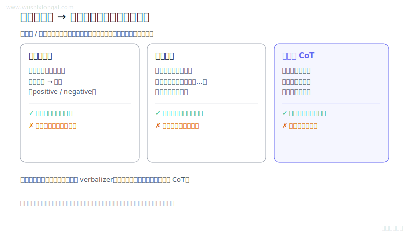
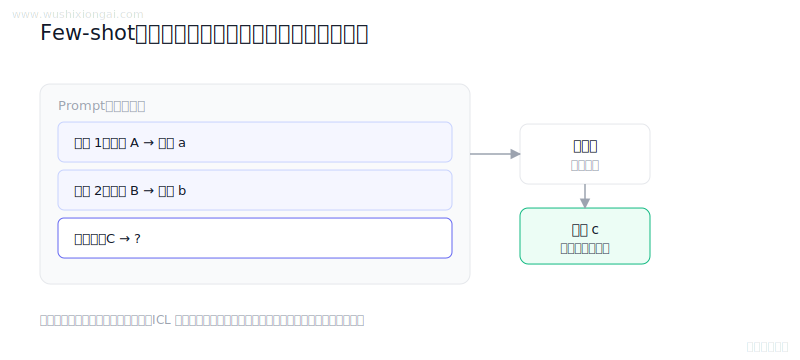
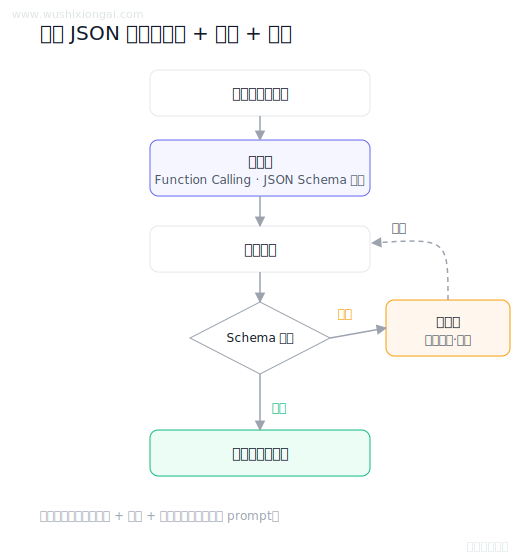

# Prompt工程图解（3 题）

任务约束、结构化输出与提示设计。本页摘要与图解均绑定正式答案哈希；答案或图解变化后，发布检查会要求重新复核。

[返回仓库首页](../README.md) · [在官网继续学习Prompt工程](https://www.wushixiongai.com/prompt-engineering?utm_source=github&utm_medium=referral&utm_campaign=interview_100&utm_content=module-prompt-engineering)

### 01. 格式化输出 vs 思维链，怎么选？

> **30 秒回答：** 判别任务可通过标签文本、模板填空、结构化生成或解释辅助转成生成建模，效果需按任务验证。
>
> **继续追问：** 可继续讨论模板偏差、标签tokenization、概率校准和多模板集成。

**复核：** 2026-07-19 · **来源等级：** B · 附可核验资料

**参考资料：**
- [Exploiting Cloze Questions for Few Shot Text Classification and Natural Language Inference](<https://arxiv.org/abs/2001.07676>)
- [Exploring the Limits of Transfer Learning with a Unified Text-to-Text Transformer](<https://arxiv.org/abs/1910.10683>)
- [Chain-of-Thought Prompting Elicits Reasoning in Large Language Models](<https://arxiv.org/abs/2201.11903>)
- [Self-Consistency Improves Chain of Thought Reasoning in Language Models](<https://arxiv.org/abs/2203.11171>)

[在官网查看「格式化输出 vs 思维链，怎么选？」的完整答案、口语讲法与连续追问](https://www.wushixiongai.com/q/arch-discriminative-to-generative-approaches?utm_source=github&utm_medium=referral&utm_campaign=interview_100&utm_content=question-arch-q0279)

---

### 02. Few-shot 推理为何有效?

> **30 秒回答：** Few-shot 示例通过改变自回归模型的条件分布帮助识别任务和格式，推理时权重不变，收益取决于示例质量、顺序与上下文预算。
>
> **继续追问：** 可继续讨论任务识别、隐式梯度假说和随机标签对照实验。

**复核：** 2026-07-19 · **来源等级：** B · 附可核验资料

**参考资料：**
- [Language Models are Few-Shot Learners](<https://arxiv.org/abs/2005.14165>)
- [An Explanation of In-context Learning as Implicit Bayesian Inference](<https://arxiv.org/abs/2111.02080>)
- [Rethinking the Role of Demonstrations](<https://arxiv.org/abs/2202.12837>)
- [What Learning Algorithm Is In-Context Learning?](<https://arxiv.org/abs/2211.15661>)

[在官网查看「Few-shot 推理为何有效?」的完整答案、口语讲法与连续追问](https://www.wushixiongai.com/q/arch-few-shot-inference-mechanism?utm_source=github&utm_medium=referral&utm_campaign=interview_100&utm_content=question-arch-q0371)

---

### 03. 怎么让模型稳定输出 JSON?

> **30 秒回答：** 稳定结构化输出应优先使用严格 Schema 或工具协议，再做解析校验、错误回灌、有限重试与失败降级。
>
> **继续追问：** Function Calling 仍然需要哪些后端校验，复杂 schema 失败时如何做重试和降级。

**复核：** 2026-07-19 · **来源等级：** C · 教学整理

[在官网查看「怎么让模型稳定输出 JSON?」的完整答案、口语讲法与连续追问](https://www.wushixiongai.com/q/prompt-json-output-prevention-retry?utm_source=github&utm_medium=referral&utm_campaign=interview_100&utm_content=question-rag-q0340)

---

[返回仓库首页](../README.md) · [在官网继续学习Prompt工程](https://www.wushixiongai.com/prompt-engineering?utm_source=github&utm_medium=referral&utm_campaign=interview_100&utm_content=module-prompt-engineering)
