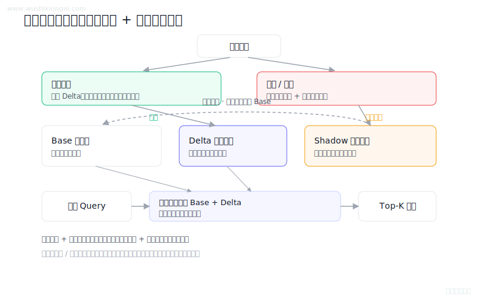
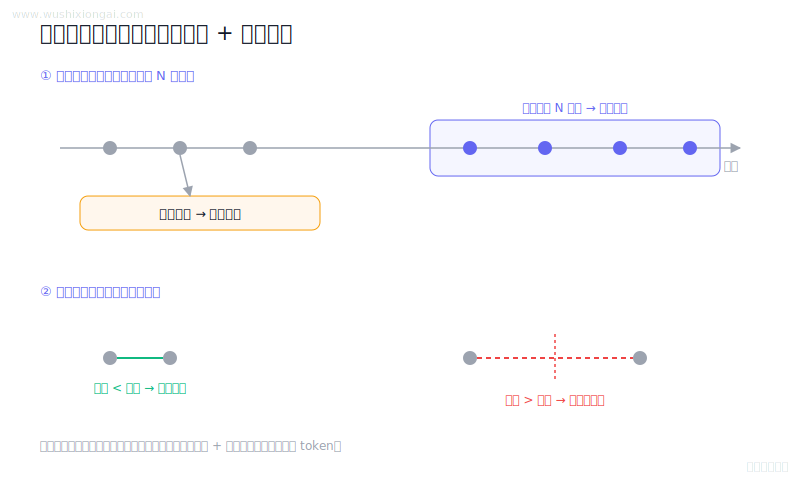
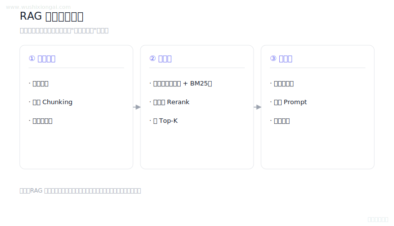
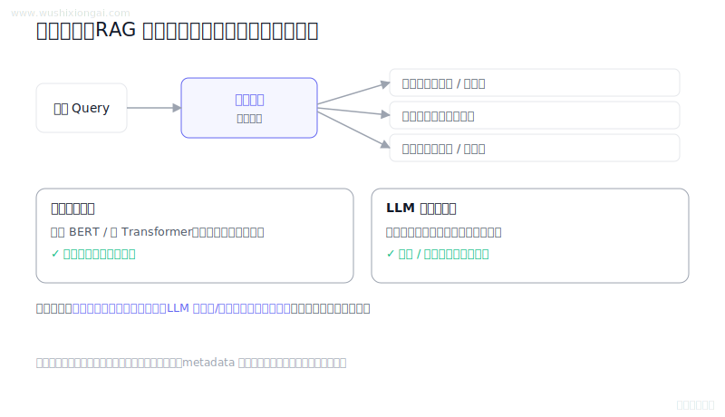
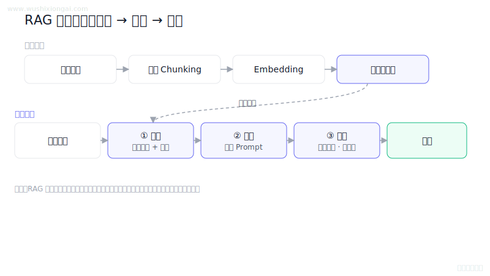
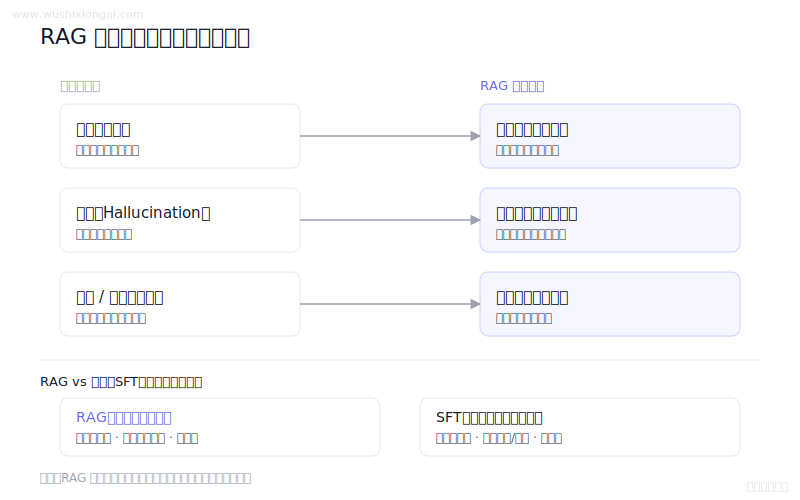

# RAG基础图解（6 题）

检索增强生成的链路、边界与验证。本页摘要与图解均绑定正式答案哈希；答案或图解变化后，发布检查会要求重新复核。

[返回仓库首页](../README.md) · [在官网继续学习RAG基础](https://www.wushixiongai.com/rag?utm_source=github&utm_medium=referral&utm_campaign=interview_100&utm_content=module-rag-foundations)

### 01. 增量式向量索引怎么更新?

> **30 秒回答：** 增量索引以 Base 和 Delta 合并服务查询，删除更新按引擎能力处理，并用版本化影子索引校验后原子切换。
>
> **继续追问：** 如何依据增量规模、删除比例、召回和延迟设置合并门槛，如何做 query 回放。

**复核：** 2026-07-19 · **来源等级：** C · 教学整理

[在官网查看「增量式向量索引怎么更新?」的完整答案、口语讲法与连续追问](https://www.wushixiongai.com/q/rag-incremental-vector-index-update?utm_source=github&utm_medium=referral&utm_campaign=interview_100&utm_content=question-rag-q0004)

---

### 02. 时间窗口对话管理机制

> **30 秒回答：** 时间窗口会淘汰或压缩过期消息，会话边界还应结合消息间隔、轮数与业务事件，并保留可回查历史。
>
> **继续追问：** 如何评估摘要质量、如何处理超时后的会话恢复、如何设计 Redis TTL 与数据库归档。

**复核：** 2026-07-19 · **来源等级：** C · 教学整理

[在官网查看「时间窗口对话管理机制」的完整答案、口语讲法与连续追问](https://www.wushixiongai.com/q/llm-time-window-dialogue-management?utm_source=github&utm_medium=referral&utm_campaign=interview_100&utm_content=question-rag-q0341)

---

### 03. RAG 系统核心组件怎么搭?

> **30 秒回答：** 完整 RAG 由文档清洗分块与元数据、混合召回和重排、上下文组装与引用生成三类组件构成。
>
> **继续追问：** 如何设计 RAG 评估集，如何定位错误来自文档、召回、重排还是生成。

**复核：** 2026-07-19 · **来源等级：** C · 教学整理

[在官网查看「RAG 系统核心组件怎么搭?」的完整答案、口语讲法与连续追问](https://www.wushixiongai.com/q/rag-components-document-retriever-generator?utm_source=github&utm_medium=referral&utm_campaign=interview_100&utm_content=question-rag-q0476)

---

### 04. RAG意图识别原理与检索协同

> **30 秒回答：** 意图识别是可选的检索路由层，低置信样本需澄清或兜底，授权仍必须由检索服务执行。
>
> **继续追问：** 可继续讨论层级意图、置信校准和提示注入防护。

**复核：** 2026-07-19 · **来源等级：** B · 附可核验资料

**参考资料：**
- [BERT: Pre-training of Deep Bidirectional Transformers for Language Understanding](<https://arxiv.org/abs/1810.04805>)
- [Retrieval-Augmented Generation for Knowledge-Intensive NLP Tasks](<https://arxiv.org/abs/2005.11401>)

[在官网查看「RAG意图识别原理与检索协同」的完整答案、口语讲法与连续追问](https://www.wushixiongai.com/q/rag-intent-recognition-module?utm_source=github&utm_medium=referral&utm_campaign=interview_100&utm_content=question-rag-q0559)

---

### 05. RAG 三阶段原理与失败场景

> **30 秒回答：** RAG 离线完成清洗、分块、向量化与索引，在线依次检索、重排、组装上下文并生成带依据的回答。
>
> **继续追问：** 如何定位 RAG 出错来自文档切块、检索、重排还是生成。

**复核：** 2026-07-19 · **来源等级：** C · 教学整理

[在官网查看「RAG 三阶段原理与失败场景」的完整答案、口语讲法与连续追问](https://www.wushixiongai.com/q/rag-three-stage-workflow-overview?utm_source=github&utm_medium=referral&utm_campaign=interview_100&utm_content=question-rag-q0630)

---

### 06. RAG 解决了哪些核心问题?

> **30 秒回答：** RAG 通过检索已更新且可授权的外部资料，为生成补充时效知识、私有知识和可追溯证据，但不能替代模型推理。
>
> **继续追问：** 什么时候选 RAG，什么时候选 SFT，什么时候需要 RAG + 微调一起做。

**复核：** 2026-07-19 · **来源等级：** C · 教学整理

[在官网查看「RAG 解决了哪些核心问题?」的完整答案、口语讲法与连续追问](https://www.wushixiongai.com/q/rag-core-problems-and-value?utm_source=github&utm_medium=referral&utm_campaign=interview_100&utm_content=question-rag-q0634)

---

[返回仓库首页](../README.md) · [在官网继续学习RAG基础](https://www.wushixiongai.com/rag?utm_source=github&utm_medium=referral&utm_campaign=interview_100&utm_content=module-rag-foundations)
