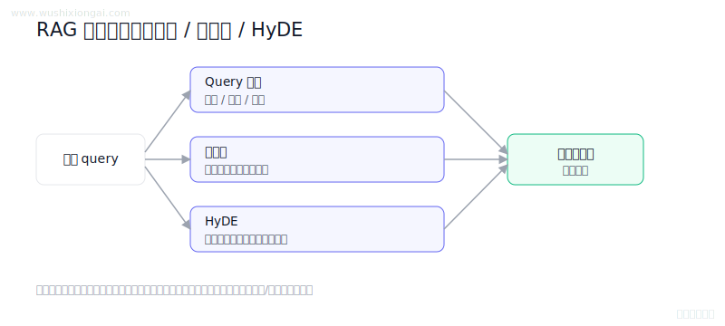
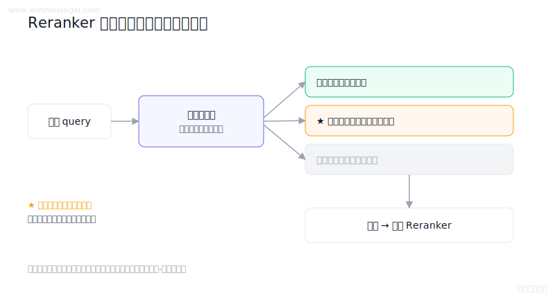
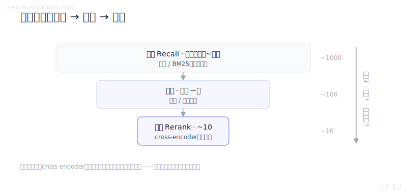
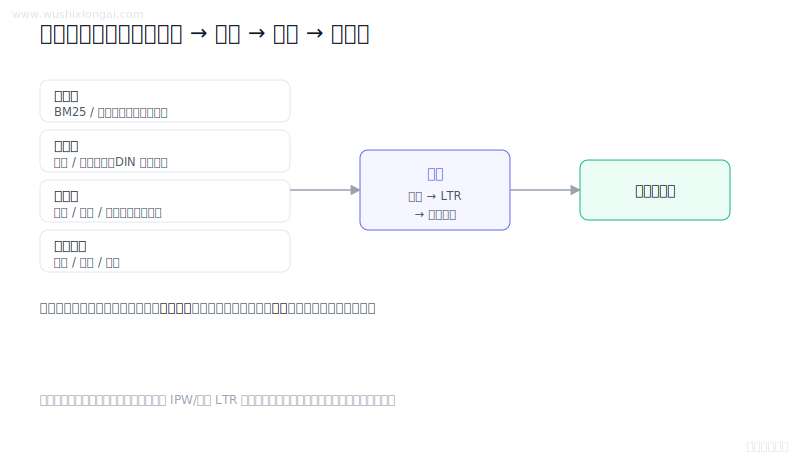
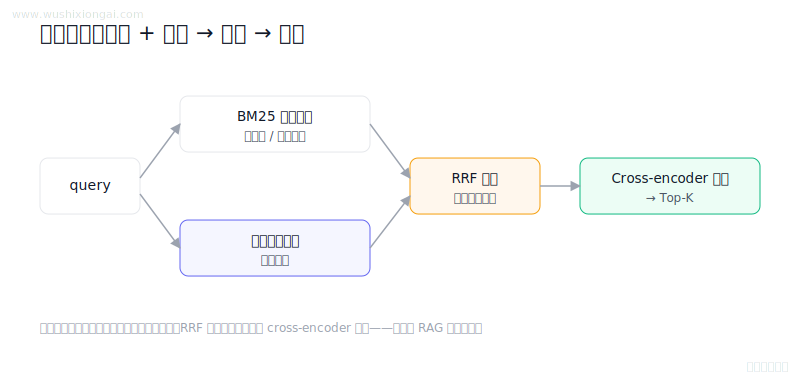

# 重排与优化图解（5 题）

Reranker、混合检索与质量优化。本页摘要与图解均绑定正式答案哈希；答案或图解变化后，发布检查会要求重新复核。

[返回仓库首页](../README.md) · [在官网继续学习重排与优化](https://www.wushixiongai.com/rerank?utm_source=github&utm_medium=referral&utm_campaign=interview_100&utm_content=module-reranking)

### 01. RAG检索质量提升5法

> **30 秒回答：** RAG 可在检索前做查询改写、多查询和 HyDE 扩展召回，并配合混合检索、重排序、上下文压缩及迭代检索验证整体质量。
>
> **继续追问：** 迭代检索的具体实现，比如Self-RAG的反思机制如何设计，或者如何控制迭代次数

**复核：** 2026-07-19 · **来源等级：** C · 教学整理

[在官网查看「RAG检索质量提升5法」的完整答案、口语讲法与连续追问](https://www.wushixiongai.com/q/rag-retrieval-relevance-boosting-methods?utm_source=github&utm_medium=referral&utm_campaign=interview_100&utm_content=question-rag-q0043)

---

### 02. Reranker 训练数据怎么构造?

> **30 秒回答：** Reranker 数据应包含真实相关正样本、线上召回分布中的难负样本和适量易负样本，并持续质检回流。
>
> **继续追问：** hard negative 怎么挖、点击日志怎么去偏、reranker 离线指标怎么和端到端答案质量对齐。

**复核：** 2026-07-19 · **来源等级：** C · 教学整理

[在官网查看「Reranker 训练数据怎么构造?」的完整答案、口语讲法与连续追问](https://www.wushixiongai.com/q/finetune-reranker-training-data-construction?utm_source=github&utm_medium=referral&utm_campaign=interview_100&utm_content=question-rag-q0117)

---

### 03. 精排精度高，为何不跳过召回粗排？

> **30 秒回答：** 精排需要对查询和候选做重型交互计算，无法覆盖百万级全集，因此先用廉价召回和粗排压缩候选，再对少量结果精细排序。
>
> **继续追问：** 具体什么条件下可以合并？有哪些模型或架构能做到？比如 ColBERT 或者 MoE 结构怎么用？

**复核：** 2026-07-19 · **来源等级：** C · 教学整理

[在官网查看「精排精度高，为何不跳过召回粗排？」的完整答案、口语讲法与连续追问](https://www.wushixiongai.com/q/rerank-recall-coarse-fine-funnel?utm_source=github&utm_medium=referral&utm_campaign=interview_100&utm_content=question-rag-q0163)

---

### 04. 多信号评分函数原理与陷阱

> **30 秒回答：** 评分函数需先定义目标与约束，再校准多源信号、处理日志偏差，并通过离线和在线实验联合验证。
>
> **继续追问：** 可继续讨论LambdaMART、点击偏差校正和多目标约束。

**复核：** 2026-07-19 · **来源等级：** B · 附可核验资料

**参考资料：**
- [From RankNet to LambdaRank to LambdaMART: An Overview](<https://www.microsoft.com/en-us/research/publication/from-ranknet-to-lambdarank-to-lambdamart-an-overview/>)
- [Unbiased Learning-to-Rank with Biased Feedback](<https://arxiv.org/abs/1608.04468>)

[在官网查看「多信号评分函数原理与陷阱」的完整答案、口语讲法与连续追问](https://www.wushixiongai.com/q/search-ranking-scoring-function-design?utm_source=github&utm_medium=referral&utm_campaign=interview_100&utm_content=question-rag-q0290)

---

### 05. BM25+向量+Cross-Encoder 怎么组合?

> **30 秒回答：** BM25 负责关键词精确召回，向量检索补充语义召回，RRF 融合两路排名后由 Cross-Encoder 对小候选集重排。
>
> **继续追问：** 负样本的具体采样方法，比如随机负采样与难负采样的差异，或者如何利用线上点击日志构造训练数据。

**复核：** 2026-07-19 · **来源等级：** C · 教学整理

[在官网查看「BM25+向量+Cross-Encoder 怎么组合?」的完整答案、口语讲法与连续追问](https://www.wushixiongai.com/q/rag-hybrid-sparse-dense-rerank?utm_source=github&utm_medium=referral&utm_campaign=interview_100&utm_content=question-rag-q0491)

---

[返回仓库首页](../README.md) · [在官网继续学习重排与优化](https://www.wushixiongai.com/rerank?utm_source=github&utm_medium=referral&utm_campaign=interview_100&utm_content=module-reranking)
