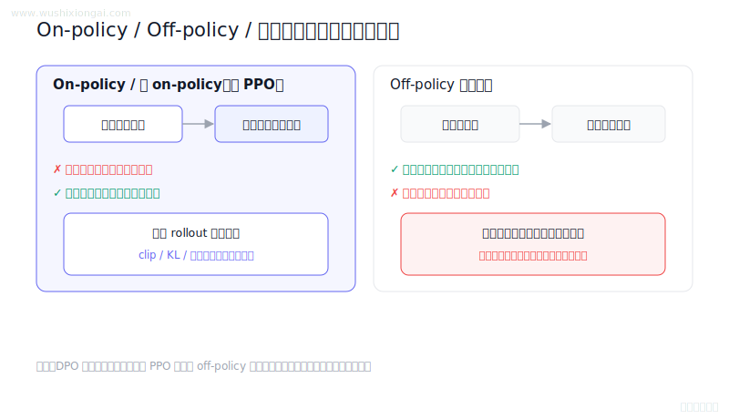
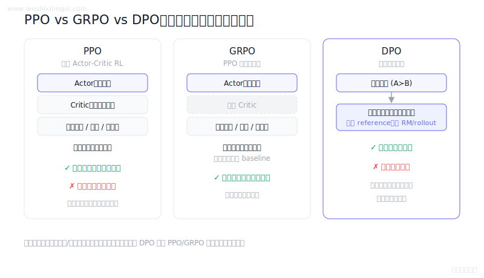
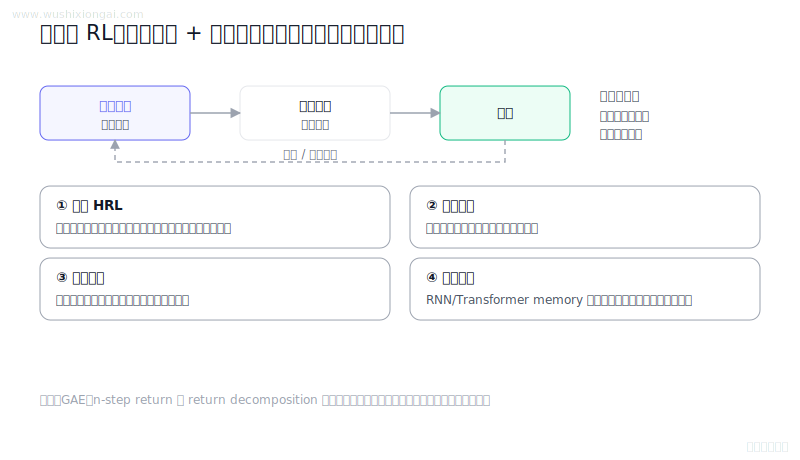
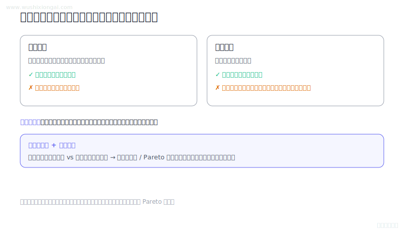
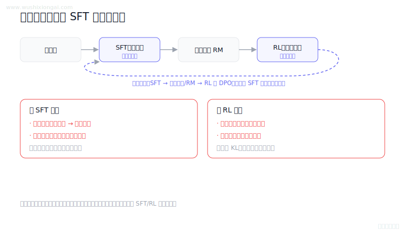
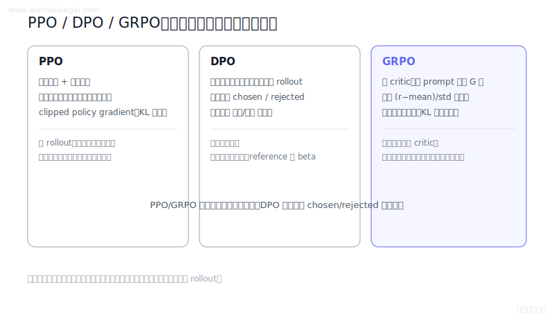
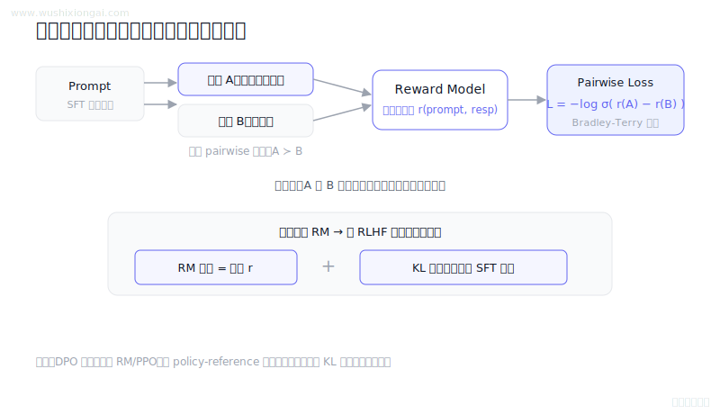

# RLHF与对齐图解（8 题）

PPO、DPO、GRPO、奖励与策略优化。本页摘要与图解均绑定正式答案哈希；答案或图解变化后，发布检查会要求重新复核。

[返回仓库首页](../README.md) · [在官网继续学习RLHF与对齐](https://www.wushixiongai.com/finetune?utm_source=github&utm_medium=referral&utm_campaign=interview_100&utm_content=module-rlhf-alignment)

### 01. On-policy、Off-policy 与 DPO 怎么选?

> **30 秒回答：** 策略数据是否由当前策略产生决定在线与离线属性，PPO近似在线而DPO直接使用离线偏好数据。
>
> **继续追问：** 可继续推导 PPO 裁剪目标、DPO 的 beta 与 reference 作用，或比较在线探索成本。

**复核：** 2026-07-19 · **来源等级：** B · 附可核验资料

**参考资料：**
- [Proximal Policy Optimization Algorithms](<https://arxiv.org/abs/1707.06347>)
- [Direct Preference Optimization: Your Language Model is Secretly a Reward Model](<https://arxiv.org/abs/2305.18290>)
- [Training language models to follow instructions with human feedback](<https://arxiv.org/abs/2203.02155>)

[在官网查看「On-policy、Off-policy 与 DPO 怎么选?」的完整答案、口语讲法与连续追问](https://www.wushixiongai.com/q/rl-on-policy-vs-off-policy?utm_source=github&utm_medium=referral&utm_campaign=interview_100&utm_content=question-rl-on-off-policy-q0318)

---

### 02. PPO vs GRPO vs DPO 原理区别?

> **30 秒回答：** PPO 依赖在线采样与价值估计，GRPO 用同提示组内相对优势省去价值模型，DPO 直接优化偏好对；选型由奖励、数据覆盖和采样预算决定。
>
> **继续追问：** 可继续讨论组标准差为零、outcome与process supervision、奖励过优化和后续GRPO变体。

**复核：** 2026-07-19 · **来源等级：** B · 附可核验资料

**参考资料：**
- [Proximal Policy Optimization Algorithms](<https://arxiv.org/abs/1707.06347>)
- [DeepSeekMath: Pushing the Limits of Mathematical Reasoning in Open Language Models](<https://arxiv.org/abs/2402.03300>)
- [Direct Preference Optimization: Your Language Model is Secretly a Reward Model](<https://arxiv.org/abs/2305.18290>)

[在官网查看「PPO vs GRPO vs DPO 原理区别?」的完整答案、口语讲法与连续追问](https://www.wushixiongai.com/q/rl-ppo-grpo-dpo-comparison?utm_source=github&utm_medium=referral&utm_campaign=interview_100&utm_content=question-rl-ppo-dpo-compare-q0239)

---

### 03. DPO vs PPO 怎么选?

> **30 秒回答：** PPO 依赖在线 rollout、奖励与价值估计闭环，DPO 直接学习离线偏好对，工程链路更短但适用反馈不同。
>
> **继续追问：** 数据标注策略、DPO的变体（如IPO、KTO）或者如何处理标注噪声。

**复核：** 2026-07-19 · **来源等级：** C · 教学整理

[在官网查看「DPO vs PPO 怎么选?」的完整答案、口语讲法与连续追问](https://www.wushixiongai.com/q/rl-dpo-vs-ppo-alignment?utm_source=github&utm_medium=referral&utm_campaign=interview_100&utm_content=question-rl-q0076)

---

### 04. 长视界任务怎么结合环境训练?

> **30 秒回答：** 长视界训练需组合分层策略、课程、奖励塑形、记忆与模型化方法，并控制部分可观测和模拟偏差。
>
> **继续追问：** potential-based shaping 的策略不变条件，或课程难度如何自动调节。

**复核：** 2026-07-19 · **来源等级：** B · 附可核验资料

**参考资料：**
- [Between MDPs and Semi-MDPs: A Framework for Temporal Abstraction in Reinforcement Learning](<https://doi.org/10.1016/S0004-3702(99)00052-1>)
- [Policy Invariance Under Reward Transformations: Theory and Application to Reward Shaping](<https://dl.acm.org/doi/10.5555/645528.657613>)
- [Curriculum Learning](<https://dl.acm.org/doi/10.1145/1553374.1553380>)
- [RUDDER: Return Decomposition for Delayed Rewards](<https://arxiv.org/abs/1806.07857>)

[在官网查看「长视界任务怎么结合环境训练?」的完整答案、口语讲法与连续追问](https://www.wushixiongai.com/q/rl-long-horizon-credit-assignment?utm_source=github&utm_medium=referral&utm_campaign=interview_100&utm_content=question-rl-q0163)

---

### 05. 稀疏与延迟奖励的塑形与权衡

> **30 秒回答：** 奖励函数要处理稀疏与延迟信用、多目标标度、塑形边界和可钻漏洞，并用消融与安全指标验证。
>
> **继续追问：** 可继续推导 potential-based shaping、GAE，或设计奖励黑客的对抗测试。

**复核：** 2026-07-19 · **来源等级：** B · 附可核验资料

**参考资料：**
- [Hindsight Experience Replay](<https://arxiv.org/abs/1707.01495>)
- [Training language models to follow instructions with human feedback](<https://arxiv.org/abs/2203.02155>)
- [Improving the Effectiveness of Potential-Based Reward Shaping in Reinforcement Learning](<https://arxiv.org/abs/2502.01307>)

[在官网查看「稀疏与延迟奖励的塑形与权衡」的完整答案、口语讲法与连续追问](https://www.wushixiongai.com/q/rl-reward-mechanism-factors?utm_source=github&utm_medium=referral&utm_campaign=interview_100&utm_content=question-rl-q0265)

---

### 06. SFT、偏好优化与 RL 怎么衔接?

> **30 秒回答：** SFT与强化学习的衔接节奏取决于能力目标、奖励可靠性和退化监控，不存在固定轮次。
>
> **继续追问：** 可继续讨论KL、PPO-ptx、replay、奖励漂移和回归集设计。

**复核：** 2026-07-19 · **来源等级：** B · 附可核验资料

**参考资料：**
- [Training language models to follow instructions with human feedback](<https://arxiv.org/abs/2203.02155>)
- [Llama 2: Open Foundation and Fine-Tuned Chat Models](<https://arxiv.org/abs/2307.09288>)
- [Direct Preference Optimization: Your Language Model is Secretly a Reward Model](<https://arxiv.org/abs/2305.18290>)

[在官网查看「SFT、偏好优化与 RL 怎么衔接?」的完整答案、口语讲法与连续追问](https://www.wushixiongai.com/q/rl-sft-rl-alternating-training?utm_source=github&utm_medium=referral&utm_campaign=interview_100&utm_content=question-rl-sft-rl-alternate-q0107)

---

### 07. PPO vs GRPO vs DPO 适用场景?

> **30 秒回答：** PPO与GRPO通常依赖在线或近在线采样，DPO直接优化离线偏好对，三者在奖励和稳定性上取舍。
>
> **继续追问：** 可继续讨论组内奖励方差、组大小和全部同奖时的训练信号。

**复核：** 2026-07-19 · **来源等级：** B · 附可核验资料

**参考资料：**
- [Proximal Policy Optimization Algorithms](<https://arxiv.org/abs/1707.06347>)
- [Direct Preference Optimization](<https://arxiv.org/abs/2305.18290>)
- [DeepSeekMath: Pushing the Limits of Mathematical Reasoning in Open Language Models](<https://arxiv.org/abs/2402.03300>)

[在官网查看「PPO vs GRPO vs DPO 适用场景?」的完整答案、口语讲法与连续追问](https://www.wushixiongai.com/q/rl-ppo-grpo-dpo-principles?utm_source=github&utm_medium=referral&utm_campaign=interview_100&utm_content=question-train-dpo-principle-q0127)

---

### 08. Reward Model 训练流程详解

> **30 秒回答：** 奖励模型用同一提示下的偏好回答对和 Bradley-Terry 损失学习相对分数，在 RLHF 中作为终局奖励并配合参考策略 KL 约束。
>
> **继续追问：** 可继续推导成对 RM loss、PPO reward 组合或 DPO 的 beta 对策略偏离的影响。

**复核：** 2026-07-19 · **来源等级：** B · 附可核验资料

**参考资料：**
- [Training language models to follow instructions with human feedback](<https://arxiv.org/abs/2203.02155>)
- [Direct Preference Optimization: Your Language Model is Secretly a Reward Model](<https://arxiv.org/abs/2305.18290>)
- [Hugging Face TRL Reward Trainer Documentation](<https://huggingface.co/docs/trl/reward_trainer>)

[在官网查看「Reward Model 训练流程详解」的完整答案、口语讲法与连续追问](https://www.wushixiongai.com/q/rl-reward-model-training-pipeline?utm_source=github&utm_medium=referral&utm_campaign=interview_100&utm_content=question-train-loss-design-q0060)

---

[返回仓库首页](../README.md) · [在官网继续学习RLHF与对齐](https://www.wushixiongai.com/finetune?utm_source=github&utm_medium=referral&utm_campaign=interview_100&utm_content=module-rlhf-alignment)
