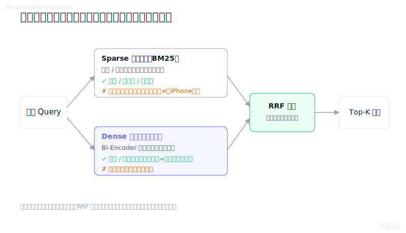
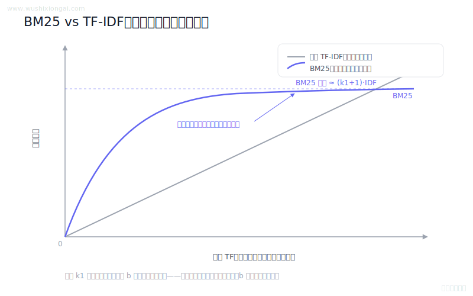
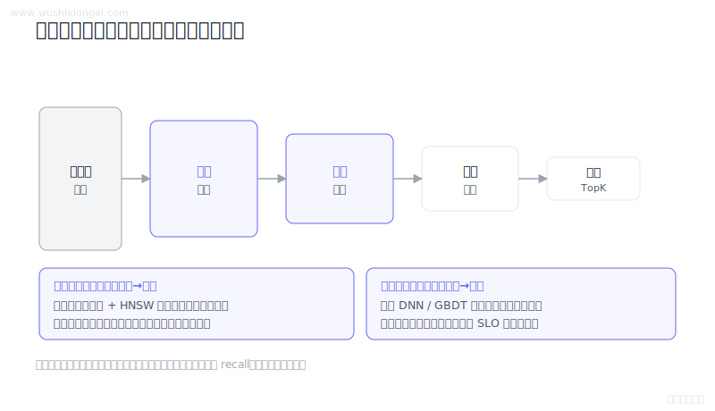
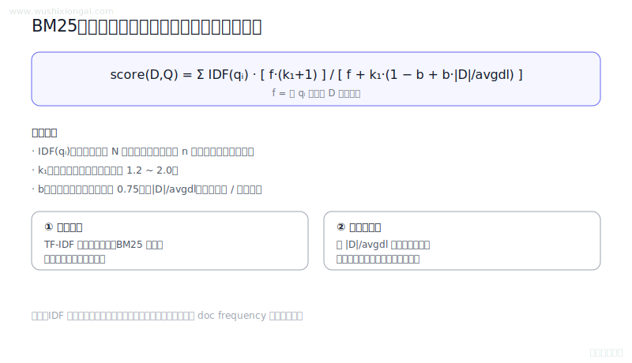
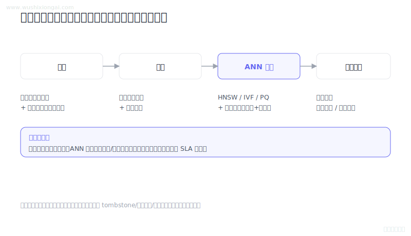
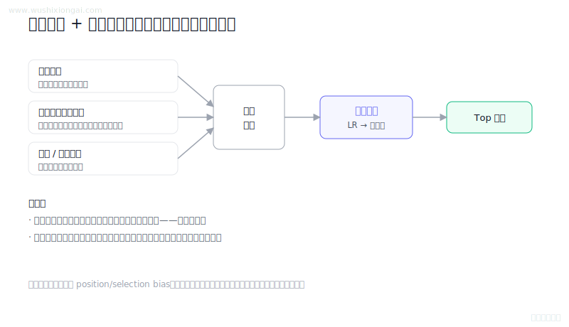
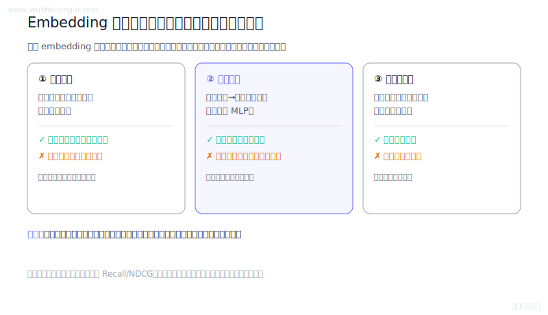
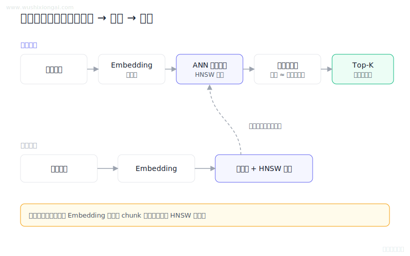
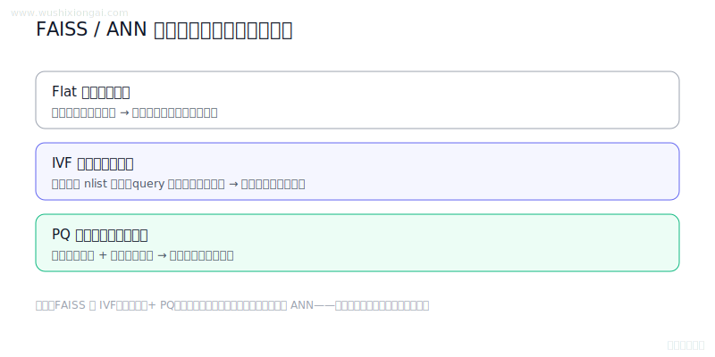

# 向量检索图解（9 题）

Embedding、ANN、召回与索引选型。本页摘要与图解均绑定正式答案哈希；答案或图解变化后，发布检查会要求重新复核。

[返回仓库首页](../README.md) · [在官网继续学习向量检索](https://www.wushixiongai.com/vector-search?utm_source=github&utm_medium=referral&utm_campaign=interview_100&utm_content=module-vector-search)

### 01. 混合检索怎么提升 RAG 召回?

> **30 秒回答：** 混合检索利用BM25词面匹配与稠密语义召回的互补性，并通过名次融合、校准或重排合并结果。
>
> **继续追问：** 可继续讨论RRF参数、分数校准和按查询类型动态路由。

**复核：** 2026-07-19 · **来源等级：** B · 附可核验资料

**参考资料：**
- [Dense Passage Retrieval for Open-Domain Question Answering](<https://arxiv.org/abs/2004.04906>)
- [Reciprocal Rank Fusion Outperforms Condorcet and Individual Rank Learning Methods](<https://dl.acm.org/doi/10.1145/1571941.1572114>)

[在官网查看「混合检索怎么提升 RAG 召回?」的完整答案、口语讲法与连续追问](https://www.wushixiongai.com/q/retrieval-hybrid-sparse-dense-design?utm_source=github&utm_medium=referral&utm_campaign=interview_100&utm_content=question-rag-q0052)

---

### 02. BM25 原理与 TF-IDF 改进点

> **30 秒回答：** BM25 用 IDF 加权查询词，并以 k1 控制词频饱和、以 b 调节文档长度归一化，避免 TF 线性放大。
>
> **继续追问：** Hybrid Search 怎么融合分数，BM25 和向量召回冲突时怎么排序。

**复核：** 2026-07-19 · **来源等级：** C · 教学整理

[在官网查看「BM25 原理与 TF-IDF 改进点」的完整答案、口语讲法与连续追问](https://www.wushixiongai.com/q/retrieval-okapi-bm-saturation-normalization?utm_source=github&utm_medium=referral&utm_campaign=interview_100&utm_content=question-rag-q0115)

---

### 03. 召回 vs 粗排怎么分工?

> **30 秒回答：** 召回以低成本保证候选覆盖，粗排按质量成本曲线可选地减轻精排负担并避免过早漏掉优质项。
>
> **继续追问：** 可继续讨论粗排蒸馏、选择偏差和多路召回配额。

**复核：** 2026-07-19 · **来源等级：** B · 附可核验资料

**参考资料：**
- [Deep Neural Networks for YouTube Recommendations](<https://research.google/pubs/deep-neural-networks-for-youtube-recommendations/>)
- [Deep Learning Recommendation Model for Personalization and Recommendation Systems](<https://arxiv.org/abs/1906.00091>)

[在官网查看「召回 vs 粗排怎么分工?」的完整答案、口语讲法与连续追问](https://www.wushixiongai.com/q/recsys-recall-pre-ranking-roles?utm_source=github&utm_medium=referral&utm_campaign=interview_100&utm_content=question-rag-q0128)

---

### 04. BM25公式参数含义与TF-IDF对比

> **30 秒回答：** BM25结合IDF、词频饱和与长度归一化，公式实现和参数需按检索引擎与目标查询集验证。
>
> **继续追问：** 可继续讨论IDF变体、字段BM25和混合检索融合。

**复核：** 2026-07-19 · **来源等级：** B · 附可核验资料

**参考资料：**
- [The Probabilistic Relevance Framework: BM25 and Beyond](<https://www.staff.city.ac.uk/~sbrp622/papers/foundations_bm25_review.pdf>)
- [Apache Lucene BM25Similarity](<https://lucene.apache.org/core/9_10_0/core/org/apache/lucene/search/similarities/BM25Similarity.html>)

[在官网查看「BM25公式参数含义与TF-IDF对比」的完整答案、口语讲法与连续追问](https://www.wushixiongai.com/q/retrieval-okapi-bm-formula-parameters?utm_source=github&utm_medium=referral&utm_campaign=interview_100&utm_content=question-rag-q0137)

---

### 05. RAG ANN 索引优化

> **30 秒回答：** 向量索引优化应以精确近邻为基线，在召回、尾延迟、内存、构建和更新成本间寻找前沿。
>
> **继续追问：** 可继续讨论HNSW扫参、量化重排和过滤执行顺序。

**复核：** 2026-07-19 · **来源等级：** B · 附可核验资料

**参考资料：**
- [Efficient and Robust Approximate Nearest Neighbor Search Using Hierarchical Navigable Small World Graphs](<https://arxiv.org/abs/1603.09320>)
- [Billion-scale similarity search with GPUs](<https://arxiv.org/abs/1702.08734>)
- [DiskANN: Fast Accurate Billion-point Nearest Neighbor Search on a Single Node](<https://www.microsoft.com/en-us/research/publication/diskann-fast-accurate-billion-point-nearest-neighbor-search-on-a-single-node/>)

[在官网查看「RAG ANN 索引优化」的完整答案、口语讲法与连续追问](https://www.wushixiongai.com/q/rag-vector-index-efficiency-recall-optimization?utm_source=github&utm_medium=referral&utm_campaign=interview_100&utm_content=question-rag-q0153)

---

### 06. 多路召回 vs 排序模型怎么分工?

> **30 秒回答：** 多路召回扩大候选覆盖，排序统一估计业务目标，两层都需处理去重、校准、日志偏差和分桶评估。
>
> **继续追问：** 可继续讨论召回配额、倾向校正和多目标重排。

**复核：** 2026-07-19 · **来源等级：** B · 附可核验资料

**参考资料：**
- [Deep Neural Networks for YouTube Recommendations](<https://research.google/pubs/deep-neural-networks-for-youtube-recommendations/>)
- [Graph Convolutional Neural Networks for Web-Scale Recommender Systems](<https://arxiv.org/abs/1806.01973>)

[在官网查看「多路召回 vs 排序模型怎么分工?」的完整答案、口语讲法与连续追问](https://www.wushixiongai.com/q/recsys-multi-channel-recall-ranking?utm_source=github&utm_medium=referral&utm_campaign=interview_100&utm_content=question-rag-q0196)

---

### 07. Embedding升级后向量对齐方案

> **30 秒回答：** Embedding升级时应隔离新旧向量空间，通过影子重建、双读评估、原子切换和回滚完成迁移。
>
> **继续追问：** 可继续讨论双写一致性、跨版本分数校准和向后兼容训练。

**复核：** 2026-07-19 · **来源等级：** B · 附可核验资料

**参考资料：**
- [Towards Backward-Compatible Representation Learning](<https://arxiv.org/abs/2003.11942>)
- [BEIR: A Heterogeneous Benchmark for Zero-shot Evaluation of Information Retrieval Models](<https://arxiv.org/abs/2104.08663>)

[在官网查看「Embedding升级后向量对齐方案」的完整答案、口语讲法与连续追问](https://www.wushixiongai.com/q/retrieval-embedding-version-migration-consistency?utm_source=github&utm_medium=referral&utm_campaign=interview_100&utm_content=question-rag-q0219)

---

### 08. 向量检索基本原理是什么?

> **30 秒回答：** 向量检索先用同一嵌入模型编码文档与查询，再借助 ANN 索引按余弦、点积或欧氏距离召回 Top-K。
>
> **继续追问：** 如何评估 Embedding 模型、如何做离线检索集、如何判断召回问题来自模型还是索引。

**复核：** 2026-07-19 · **来源等级：** C · 教学整理

[在官网查看「向量检索基本原理是什么?」的完整答案、口语讲法与连续追问](https://www.wushixiongai.com/q/retrieval-vector-search-fundamentals?utm_source=github&utm_medium=referral&utm_campaign=interview_100&utm_content=question-rag-q0632)

---

### 09. FAISS 怎么实现高效 ANN 搜索?

> **30 秒回答：** FAISS 通过 IVF 只探测部分聚类桶，并用 PQ 压缩向量和查表估距，以牺牲可控召回率换取大规模近似近邻的速度与内存收益。
>
> **继续追问：** OPQ的具体原理，或者问还有哪些改进IVFPQ精度的方法，比如多码本、非对称距离计算等。

**复核：** 2026-07-19 · **来源等级：** C · 教学整理

[在官网查看「FAISS 怎么实现高效 ANN 搜索?」的完整答案、口语讲法与连续追问](https://www.wushixiongai.com/q/infra-faiss-similarity-search?utm_source=github&utm_medium=referral&utm_campaign=interview_100&utm_content=question-sys-q0331)

---

[返回仓库首页](../README.md) · [在官网继续学习向量检索](https://www.wushixiongai.com/vector-search?utm_source=github&utm_medium=referral&utm_campaign=interview_100&utm_content=module-vector-search)
